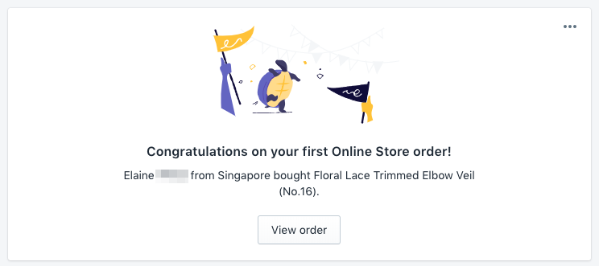

Eleven days after launching our online wedding veil shop, we've made our first sale. What a wonderful day!

The customer is actually one of my wife's bridal clients who's about to get married in December. She bought a piece of our [lace-trimmed elbow-length veil](https://angveilyu.com/collections/the-unveiling-collection-handmade-wedding-veils/products/floral-lace-trimmed-elbow-veil), one of 8 veils in our [first collection](https://angveilyu.com/collections/the-unveiling-collection-handmade-wedding-veils).

I'm really happy with how quickly we managed to make our first sale considering that each veil is $200 to $500. To me, it validates that there is unmet demand for high-quality wedding veils, at least in Singapore.

We're attributing this sale to word of mouth. Once my wife mentioned that we make veils to her, she took out her phone, browsed the site for a few minutes, and made the purchase

Thank you, Elaine, for being the first customer of [ang veil yú](https://angveilyu.com)!
