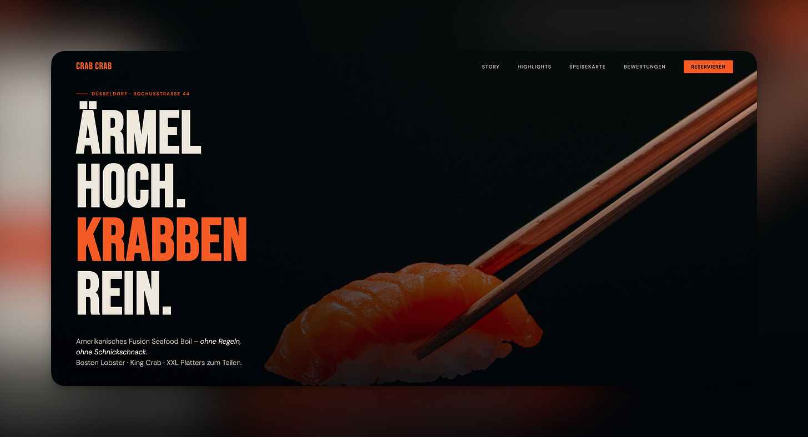

Hey folks. So, just a quick update on what I’ve been up to in this Slow Riches phase of my life. The whole thing is actually a talking head video that I’ve recorded on a whim (10 mins). You can either watch the video or you can read the transcript below:)

---

## NanoClaw vs OpenClaw experiments - personal agents

I’ve pivoted to experimenting with a bunch of things. The first thing I’ve been playing around with is called NanoClaw. If you haven’t heard, there’s this thing called OpenClaw, and it is a huge project.

I tried it and didn’t quite like it, because it was quite hard to use. There were a lot of bugs, and it gave the LLM way too much access to everything. So now I’m using NanoClaw, which is a much smaller implementation — how small? 4,000 lines of code, compared to OpenClaw, which is 400,000 lines of code.

So it gave me a sense of safety, and I also understand it from reading the code itself — using Claude Code to read the code with me and asking the right questions. I understood that it operates with an OS-level security boundary, meaning it is incapable of escaping itself and also exfiltrating data from the computer as easily. It’s still possible, because it has full network access — meaning it can go to the internet and send stuff there if a bad skill gets in there — but the agent is not able to modify itself, and so on.

Anyway, the point of setting up NanoClaw is to be able to experience the future of agentic programming: just having a personal agent, 24/7, running for you, doing stuff for you. You interact with this agent via Telegram, and I’ve been trying that and it’s been pretty stable.

There have been quite a lot of things that I had to fix, and it’s still a learning process — and this is just the beginning. I was pretty close to shutting it down because of some annoying bugs, like me telling it to make changes to one of my repositories, and then it goes off and does the actual work — but then later, when it’s done, it tells me: “Oh, I don’t have credentials. I can’t send it to GitHub. I can’t push it there.”

And in my mind I’m just like, I definitely gave you a personal access token. You verified it. You’ve actually pushed things before. Why are you not remembering this?

Yeah, so I had to debug what the issue was, and we managed to get to the bottom of it. Things should improve from there. So that’s the first thing — it’s been fun, mostly, using NanoClaw.

---

## Chasing money: the restaurant website idea

Then the second thing: I’m a bit stressed at the moment because of certain changes that are going to come in our lives. I’ll probably tell you guys more when I’m ready to talk about it. But I’m preparing for something big, and I need some money, quite soon.

So I’ve decided to do some stuff that is more directly chasing money. Maybe that should have been my approach right from the beginning. My hand is getting a bit tired holding this camera, but — I’m finally going more directly to where the cash is.

My idea is to look through Google Maps, find restaurants whose websites are either outdated or just non-existent, and then reach out. I’m going to build sites for them that are improved from their existing ones — or if they don’t have one, just something amazing — deployed already, with a link they can click and immediately see their actual restaurant website, live. It’s just not theirs yet. They would have to pay me, and also work with me for maybe one or two iterations to make the content stick: align it to their marketing and brand strategy, swap in images that are actually theirs, and so on.

I’m charging 500 euros per project at the moment, which is very, very low, to be completely honest, compared to other design agencies — or any sort of agency. Even a one-person shop usually charges upwards of 1,000 to 2,000 euros, based on my market research here in Germany. So 500 is a steal, and I’ve already done the upfront work for them. I’m just asking them to basically hand over the money and they can get the site right away.

One of the websites I’ve made unsolicited for an actual restaurant in Düsseldorf:D

So that’s my thing at the moment this week. It’s not very sexy — I wish I was building a product and people would be paying me on a subscription basis or something like that, which is the typical success story you see online.

But I’ve found that the app business thing is a lot harder than it seems, mainly because I’m very uncomfortable with marketing, and I think there’s a lot more to unpack there. If you do it well, you probably get a lot of attention — which is the name of the game with marketing. I just never really had success doing that. Maybe I’m too honest. Maybe I have some kind of mental block about what marketing really is. So I really didn’t see how I would succeed continuing to build apps at the moment, even if the product was really good.

The only way I can see it going into the stratosphere — the way OpenClaw recently did with Peter Steinberger’s project — is if it was an incredible, category-defining product. But to work on that requires the luxury of time, which I don’t really have at the moment. So I’m going a bit more directly after the money.

---

## What “Slow Riches” actually means

And I think it’s quite in line with what I’m trying to do here with Slow Riches. I think I haven’t fully explained what my idea here is, but — Slow Riches, two words.

“Slow” is kind of this lifestyle thing that I feel here in Germany. The way people live here is a lot more deliberate. If you think of the slow food movement, it’s an answer — an antidote — to fast food, where you’re essentially harming yourself by eating trashy food made fast. Slow food is where you actually enjoy healthy, fresh ingredients, live-prepared. You have to wait a bit longer, and you slowly savour it when it arrives. So “slow” is like that. When I think of slow, I think of Germany.

And “Riches” is not Germany. When I think of Riches, I think of Singapore, which is where I’m from. Why? Because it’s highly efficient. Highly optimised. It’s a place where people are competitive, where people are really trying to make the best of things. And that fits really well with the current zeitgeist of AI. Everyone who is trying not to be left behind is doing their very best to keep up — by practising with the tools regularly, building the foundation of their own workflows on AI, and then adding more on top.

---

## Managing agents, and where things are headed

I’m doing a lot of that now. I can’t imagine, if I were still employed, how I would keep up — because I have the full day nowadays to work on this stuff, and I still find it difficult to build out a truly great workflow. It’s pretty good, I would say, but not great. I know where it can still improve.

We’re getting to the point where I am starting to manage multiple agents, and the agents themselves are also managing sub-agents. So it’s getting pretty exciting, honestly.

To give you a glimpse: to create the demo websites, I don’t write a single line of code anymore. For the restaurant business idea I mentioned, I just go to Google Maps, and I’ve created a bunch of skills for Claude Code. I give it a link, the relevant skill kicks off, and it does research into the current website — looking at what features are there — and then it passes that on and calls the next skill. The next skill is about building the demo site itself, based on what already exists in their current website. It follows the typography, it follows the style, it even pulls in real images, real menu items, real prices.

So you can imagine — I’m just chaining everything together and I just say, “Here’s the URL, now create a site.” And the results are excellent, honestly.

It’s not fully automated yet — the sending of the pitch, for example, I still have to do myself, and I honestly have a lot to learn about how to pitch properly to restaurant owners. But that’s just a glimpse of where things are headed, and I’m honestly very excited about it.

---

At the same time, I need to make money. I’m not fully letting myself go in terms of tinkering and experimenting — I’m actually trying to learn as I go and apply it to actually making money.

Okay, this video is getting a bit long. I hope this update makes some sense. Whatever you’re doing right now, I hope you’re doing some kind of AI stuff — because if not, you are likely to be left behind. I’m not trying to scare you, but I do think that 2026 is going to be a very pivotal year for most of us in our careers. The sooner you start learning how to use AI in your own work, the less likely you are to be left behind.

Yeah, let’s leave it there. If you have any comments, thoughts about the format, follow-on questions, or things you want me to talk about — just let me know. Peace.
