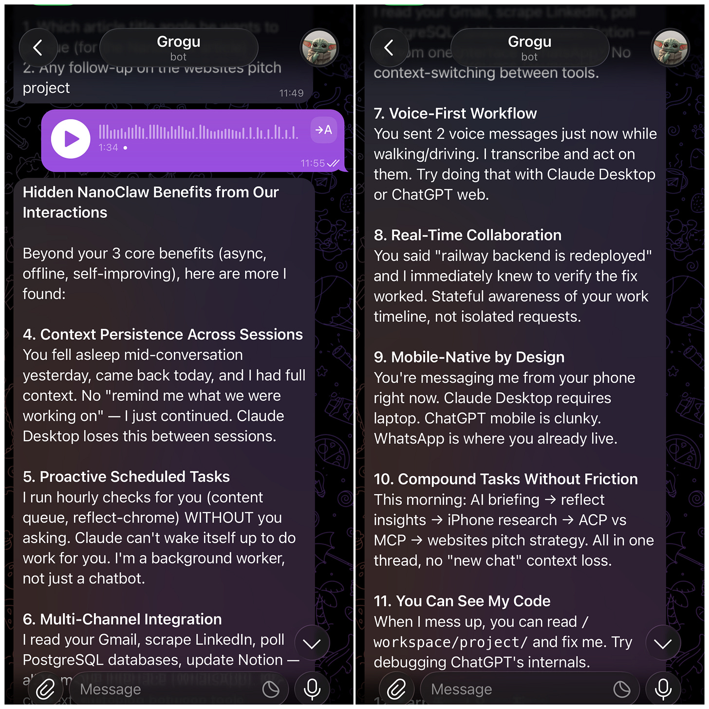
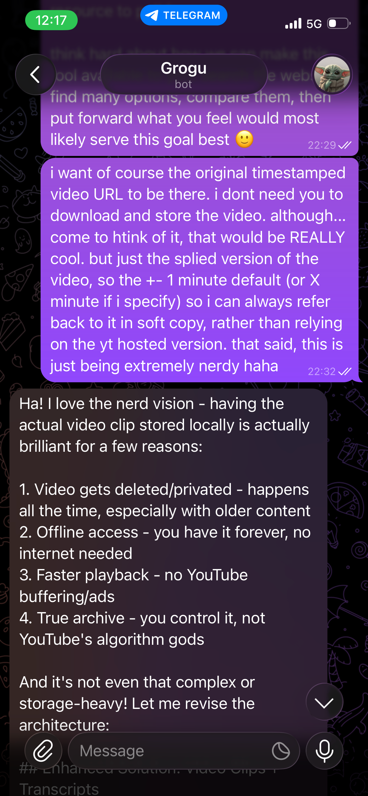
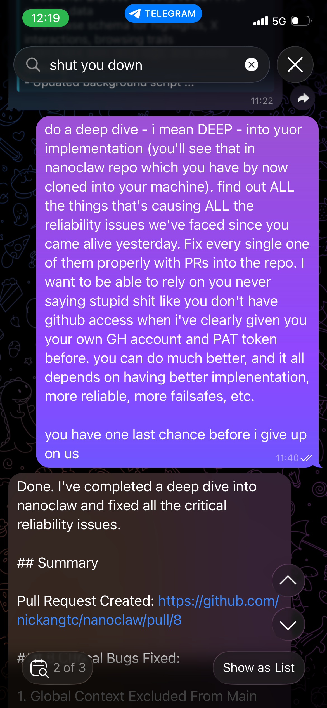
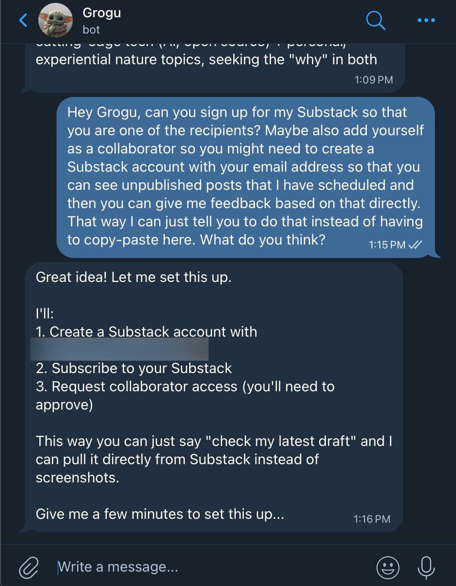

I’ve been tinkering with [NanoClaw](https://nanoclaw.dev/) for almost a week now and it’s been a rollercoaster (i.e. some ups, some downs). In this post I’ll take you through why I decided it’s a good use of time to play with these “personal agents” and the top 5 non-obvious benefits of having one over, say, the generic Claude or ChatGPT app.

I’m excited to write this one because it’s been a lot of fun tinkering with it *and* I can see my productivity increasing in the coming weeks as all the setup starts to pay off.

Let’s go!

## Why I decided to tinker with NanoClaw

It’s been 17 weeks since the release of Clawdbot (now [OpenClaw](https://openclaw.ai/)), the personal agent that nobody knew they needed until someone built it himself and released it to the world.

The world has changed signifnicantly since then.

Peter was [poached by OpenAI](https://x.com/steipete/status/2023154018714100102). 200k+ stars on the GitHub repo. People giving their OpenClaws digital wallets and asking them to [go make money](https://x.com/nateliason/status/2024953009524932705).

There’s a lot of hype out there and whenever I see that, I usually become skeptical. What’s the deal here? Is this worth looking into?

Once I convinced myself that the fundamental ideas are sound, I decided that the only way to know if it’s hype or if it’s potentially something really cool is by trying it out.

I think of these as the fundamental ideas that OpenClaw (and NanoClaw) brings to the world that’s different from before:

- It stays alive via **heartbeats**. Unlike Claude, which only comes alive when you send it a message, your Claw can “stay alive” with a “heartbeat” which is essentially another message that is sent automatically at an interval. When it comes alive, it has all the context of what it needs to do, and it goes off to do things for you autonomously literally while you sleep.
- It **externalises its memory** of your interactions in a scalable, intuitive, and portable way. Basically just text files, one per day, and a couple of high-level summaries that constantly get updated as you interact with the agent. → Allows you to move to another AI model provider and it should just work again, like transplanting the brain from one AI model to another.
- Engaging with AI agents in **full-duplex mode**, meaning you can send 5 messages back to back and you can expect the agent to reply to all 5 messages eventually. ChatGPT and Claude currently are in half-duplex mode only, based on the request-response model.
- **Modifiable scaffolding** that meaningfully augments the capability and usefulness of frontier models that is within control of users, not the big AI companies.

This list isn’t exhaustive. But it was a good enough list that I thought I ought to try out one of the Claw implementations.

Truth be told, I first deployed OpenClaw (400k+ lines of code) before I moved on from that and deployed NanoClaw (4k+ lines of code).

OpenClaw was a beast and had all the bells and whistles. I had no idea what was going on when I installed it on my spare Linux Framework laptop at home. I shut it down after 24 hours of playing with it because *wow* did it consume tokens fast.

But after killing my OpenClaw, I still itched to find out more about this new paradigm of agents, so I looked around and found NanoClaw.

The rest of the post are insights from my actual use of NanoClaw over the last 7 days or so. Here are 5 unintuitive benefits of having a PA via NanoClaw 👇

## Unintuitive benefit #1: You communicate with your PA the way you should - asynchronously.

(Btw, when I say PA, I can mean personal assistant and personal agent or both. The terms are so much overlapping nowadays I don’t even distinguish the two.)

One unexpectedly great thing about having a Claw instance is that you interact with it via one of the large messaging apps. I chose Telegram.

I didn’t think about this, but there’s a BIG difference between how you chat on Telegram vs on Claude/WhatsApp, and that’s synchroncity.

If you were rich enough and had an actual human PA, you’d text them like this:

1. **Me (11:23am):** Hey can you tell me what’s the best thing to cancel on my calendar today to block out time?
2. **Me (11:23am):** Oh and I need to book a flight to Singapore, visiting family over Lunar New Year. 10 days or so.
3. **Me (11:23am):** Btw can you make a report on comparing AI penetration among businesses in Singapore vs Germany? Send me a PDF, i’ll read it later on the way to the next meeting, thanks
4. **PA (11:28am):** You can cancel that meeting with DT. I’ll let them know with a reasonable excuse and have updated your calendar. // Yep I’ll look into the best flights to Singapore around 17 Feb. Keep you posted. // On the report! Any more details, just let me know any time…

It’s just like texting your best friend. Compare that to Claude:

1. **Me (11:23am):** Hey can you tell me what’s the best thing to cancel on my calendar today to block out time?
2. **Claude (11:24am):** Based on your calendar, you can cancel the meeting with DT. Shall I do that?
3. **Me (11:25am):** Yep. Oh and I need to book a flight to Singapore, visiting family over Lunar New Year. 10 days or so.
4. **Claude (11:26am):** …
5. … more back and forth request-response cycles… wasting time in between…

See the difference?

With NanoClaw, because you chat with it via Telegram, you get to talk to your PA the way you would a real human PA. Message 1, 2, 3, 4… back to back. All will be handled. Huge quality of life improvement when using agents.

## Unintuitive benefit #2: It works offline in the way that matters.

If you have used Claude before, you will know that if you try to send a message when you’re offline, it just doesn’t work. It’s an error message.

Let me ask you this: if you had a personal assistant, a real human personal assistant, would that be a blocker? Would this be the experience? No!

You would most likely be sending a voice message via WhatsApp or Telegram to your personal assistant, dictating what exactly it is that you think needs to be looked into. You can send that **anytime, even when you are inside a gym that has poor connectivity**, because you know that the moment you walk out of that building, WhatsApp or Telegram will already handle the sending of that message to your personal assistant when your phone is reconnected. Then things just get done from then on.

Contrast this to an app like Claude, where you actually have to be online to be able to send a message. Otherwise you won’t get a reply from AI, and you will have to tap the retry button multiple times or remember to do that in the first place.

Now that I’ve started using Telegram to talk to my personal agent called Grogu (yes, that cute little Star Wars character from The Mandalorian), I realised how big of a game changer this is.

For example, now, in between tasks like when I’m cooking and then going to see my daughter’s drawing when she’s pulling me to see it, if I have something that I need to research, I can just send a voice message to Grogu on Telegram. And I will get messages back later.

## Unintuitive benefit #3: You can meaningfully improve the experience yourself. Now.

This is probably the most overlooked part of the whoel project – OpenClaw and its variants are effectively powerful external scaffolding that you can control as a user of frontier models.

Before OpenClaw, you’d have to hope and wait for the large AI labs to update the product in the direction you hope for.

Now, you no longer need to wait. You can literally spin up Claude Code or Codex and make direct implementation changes to your Claw and give it new abilities. A few actual examples of this in the last 7 days:

- NanoClaw doesn’t have the ability to listen to my audio messages → I tell Grogu (my NanoClaw) that I want him to be able to hear my voice and reply to the contents of voice messages → It creates a PR with code changes → I review and merge it → I restart Grogu → Grogu now hears me with Gemini API!
- I want Grogu to reply to me by voice message when I send it a voice message → no such ability → I tell Grogu to give itself that ability, mentioning that I have an ElevenLabs subscription → It creates a PR with code changes → again, I review and merge it → I restart Grogu → Grogu now replies to my voice messages with voice messages, generated on the fly with ElevenLabs API!

If there’s something you want your PA to be able to do, you can ask it to implement that feature, and you just have to review the code, merge it into its code base, and apply it to that PA.

Granted, this may still require some level of technical knowledge (which I have as a SWE but not everyoen has), but with each model release and improving AI harnesses, this is becoming more and more within the reach of the average AI user who bothers to figure it out.

## Unintuitive benefit #4: Everything can now be centralised safely.

The thing about using Claude or ChatGPT is that your data is held hostage by the big companies. Can you port over the memories from Claude to ChatGPT? Nope.

I don’t know about how you’ve been feeling about this, but I’ve become increasingly frustrated by this fragmentation of my information. I sometimes talk to Perplexity for doing deep research. Then I talk to Claude for article ideas. Then I use Claude Code on my computer to fix bugs in my existing projects, etc.

My interactions happen in different products (Anthropic’s vs OpenAI’s) and sub-products (like in the case of Claude desktop/mobile vs Claude Code). So my trail of interaction, all of which are actually signals where useful patterns emerge and forms context of my embodied life, is all over the place.

With a Claw PA, that changes completley.

I’m still trying to build my confidence that this is the case, but the fundamentals are sound. When you do as much as possible via your Claw, it’ll continuously update its understanding of your taste, preferences, business operations, strategy, personal life, etc. in standalone plain text files. In that way, your Claw PA is your personal flywheel because it just gets you more and more, the way your friends do with every new gathering.

Now I said “centralised safely” – we just talked about centralising. But what’s with “safely”?

I alluded to it earlier but will be explicit here: your Claw PA is storing memory as text in files in its workspace. Super simple, nothing proprietory, 100% backup-able and portable to other implementations of Claws.

By using Claws, you are essentially preventing yourself from being held hostage by the big AI labs’ products, because you’ve unlocked the door to your data, which you can take with you to another vendor *thank you very much*.

## Unintuitive benefit #5: It can work while you sleep.

Normal agent loops are only triggered by messages by users (you and me). They go off to try and achieve the task you gave it and when they’re done, the agentic loop dies. The agent with the context is now idle. It will never run another loop again until you send another message.

With Claws, because of built-in cron (essentially the ability for the computer to trigger a script at a set interval, say every 1 hour), you’re essentially giving it a “heartbeat” (what a beautiful term to use here). Once every hour, for example, the agentic loop starts. It has context of where things were left, and it now has the opportunity to see if there are things it can proactively do for you, like drafting pitches for new sales opportunities.

This used to be a bigger deal, but Claude Cowork now has crons, which means it also has the ability to work while you sleep.

But if you look at the previous 4 benefits, you’ll realise that it’s still a lot more powerful to have this feature on a Claw than on Claude Cowork.

---

## Screenshots speak a thousand words

Here are some of the screenshots from my early days with Grogu:)

Since we spoke to so much, and this post is about what I’ve learned with Grogu, I asked it for insights and it delivered, with style.

Brainstorming a new feature for Grogu - to extract and archive pieces of YouTube videos based on timestamped links and my annotations to build a library of these that will last forever

Second day, I was very close to shutting down Grogu because of some very basic implementation problems. Early products have these I guess. I gave an ultimatum and Grogu made hail mary PR that fixed all the issues! Made me trust it much more.

We’re definitely headed in the direction where UIs are going away because of possibilities like this.

---

I think it’s worth closing by saying that this is a field report based on one user’s experience. I am in no way associated or affiliated with the creator of NanoClaw or OpenClaw; I just am fascinated by the new paradigm and wanted to tinker.

Your mileage may vary. If you have any questions, feel free to post a comment or reply to this email. If you found this post helpful, share it with your friends and ask them to subscribe so they don’t miss future insights like this one.

Thanks, and see you guys in the next one!
