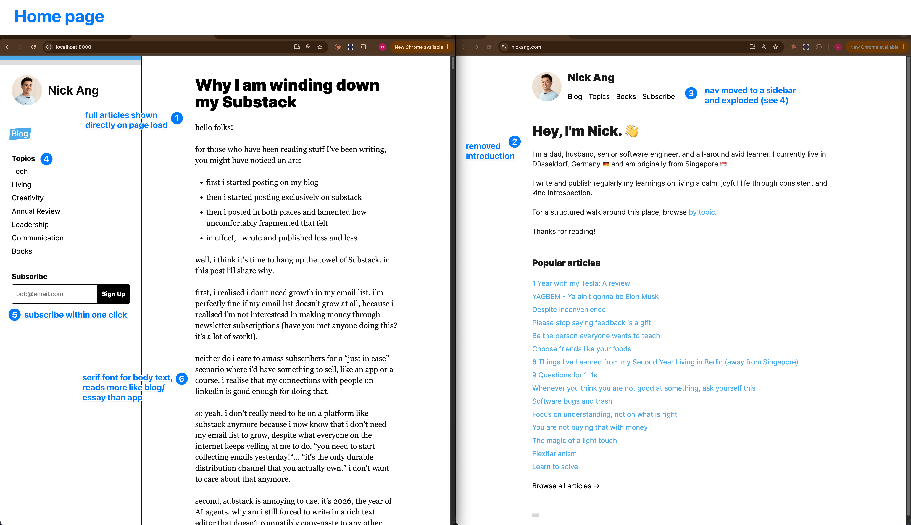
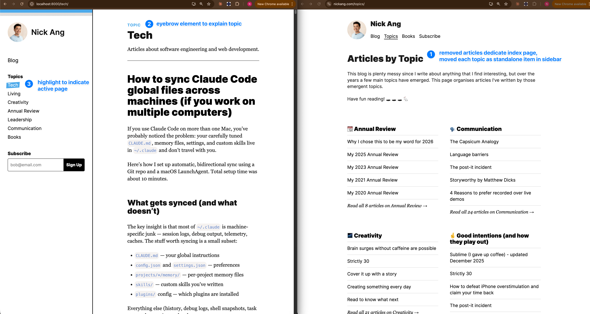
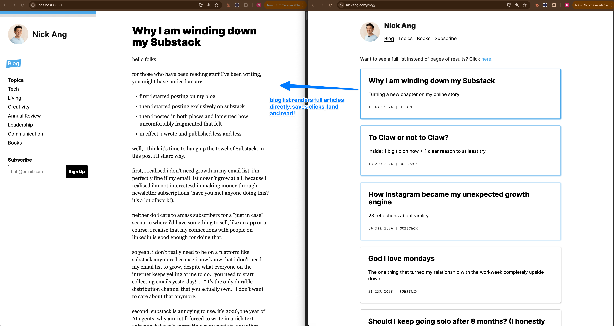
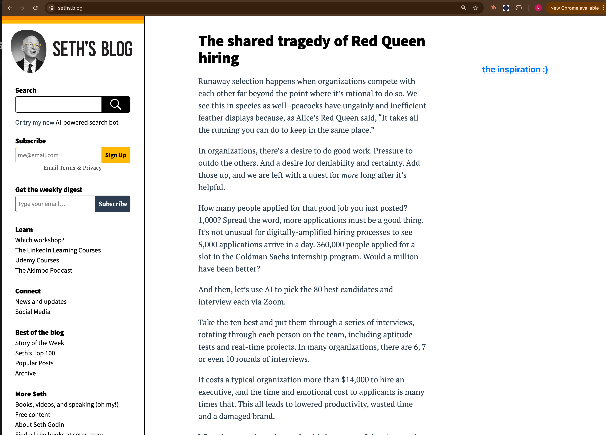

this blog is now 10 years old! the first post was about [deciding what cities to visit](/2016-03-01-how-to-decide-what-cities-to-visit/), published on March 1, 2016, so i thought it's time to pause and reflect on the simple question:

> is this blog still an accurate reflection of who i am and what i stand for?

i've just wound down my substack newsletter and am coming back to my online home base - this blog - so it also felt timely to consider a fresh coat of paint.

in the rest of this post i'll share the changes made and some of the reasoning behind those changes. my goal at a high level are to:

- evoke melancholy, kindness, and directness - the aspects of emotional intelligence that i care about now
- create an aura of competence in specific areas like computer science, software engineering, leadership, communications, etc.
- simplify - let beauty emerge from structured space, with a deep appreciation that beauty motivates change in people (think art)

i'm far from a finished product myself in terms of design taste, so i expect not to have achieved all those lofty goals, but i hope i've moved in the right direction.

alright, on to the changes.

first, the home page has changed in a few ways:

1. the home page no longer shows a static page but instead shows 8 full blog posts - the thinking here is that the content should be readable on landing instead of having to click
2. the self-introduction has been completely removed - i will likely reinstate this in the sidebar with a "About Nick" item
3. nav items are now moved to a left sidebar - to make better use of desktop sized readers since there's so much horizontal space unused. the sidebar allows visitors to remember whose site they're looking at regardless of which page they're on. it's like you're in my house an i welcome you, but i'm also watching you :)
4. the nav hierarchy is flattened so topics, for example, render directly as items - the thinking here is that flatter navs are faster and provide clearer signals to visitors about what's important to me as a writer that they're consider reading
5. email form is now one-click from submission instead of being nested inside a dedicated "subscribe" page - this should increase conversions by eliminating the need for visitors to hunt for it
6. post content body is now serif font instead of sans serif, giving a more personal blog/essay feel instead of a polished app feel. serif fonts feel more melancholic in my opinion

second, as mentioned, the topics have been laid bare directly on the sidebar.

i cleaned up the topics by removing "interviewing" and "good intentions" as i don't quite care about those topics as much anymore.

there was a problem with visual hierarchy when i made this change. previously, the "Topics" page had an explainer on top and then there are clear lists below which are visually distinct from the explainer.

after the change, the explainer remains up top and then full articles are rendered directly below. the problem here is that articles have h1 titles - and so does the topic's page title!

the way i chose to add visual distinction to break up the explainer and the start of the first topical blog post is by adding two simple things:

1. an eyebrow that says "TOPIC" in blue
2. a horizontal rule to break the vertical rhythm

i think it works quite well!

finally, the homepage is now the blog list page. i've chosen to render the full blog posts instead of just the title, excerpt, and date. this reduces the distance between landing and reading something, which should improve the speed to connection between me (via my writing) and you (the reader).

that's it!

and now, to reveal the inspiration... Seth Godin's blog:

did i mention i'm still developing my design taste? i'm honestly not far enough along the growth curve to imagine good layouts. give me an empty room and i'll be completely lost about interior design. so i had to look for inspiration on the open web.

Seth is notably not a developer, while i am (so far) - so why did i choose his blog as an inspiration? there are a few reasons:

- i don't really identify as a developer anymore, especially with AI. i've written before that i never really did identify as a developer strongly because i always saw programming as a means to an end anyway, so there's that, too
- seth is a monster at writing consistently! and as someone prolific, i'm sure he's given some thought into his blog's design. if someone who has blogged every day for **24 years** chose to present his writing this way, i take it as a signal that it works well enough
- developer blogs like https://mariozechner.at/ and https://www.swyx.io/ give me the feeling of technical competence and superiority while lacking in structure and polish
- i'm in the stage of my career now that i'm breaking away from the engineer/developer archetype and moving into more of a builder/leader archetype, so a thought leadership style blog like Seth's, i thought, makes sense

and there you have it!

i'm going to add search functionality so that the 559 posts i've written so far can be easily filtered. other than that, i think this revamp stops here. it took me 2 hours to do this with pi and gpt-5.5.
