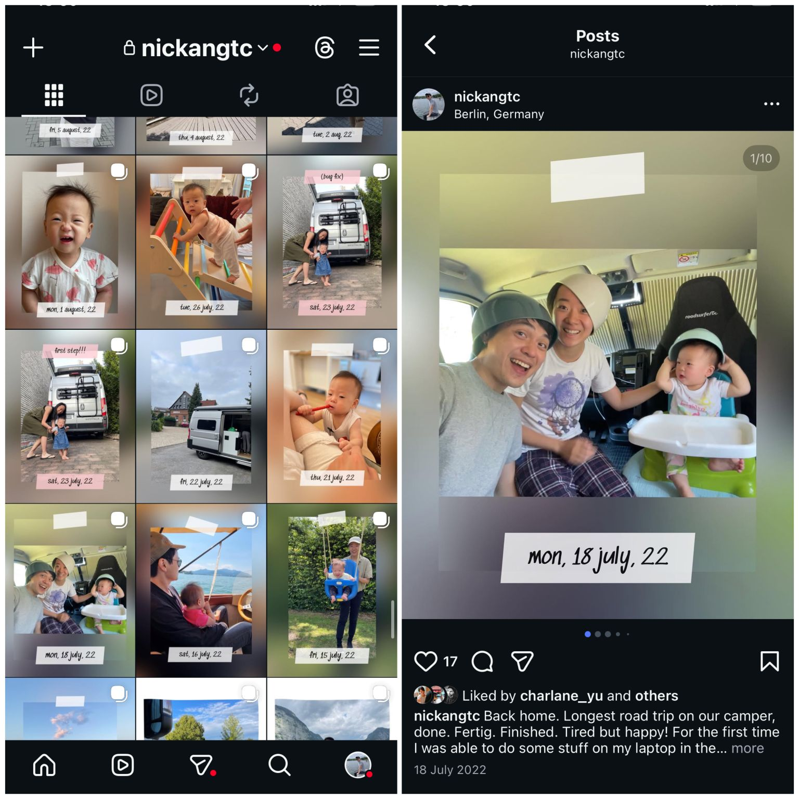
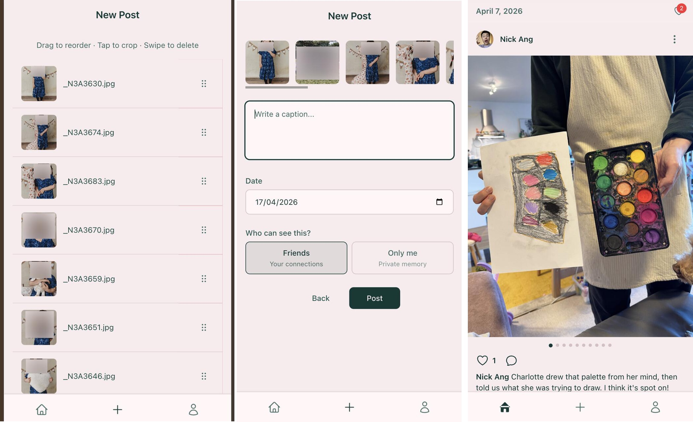

<iframe
  width="560"
  height="315"
  src="https://www.youtube.com/embed/sPKehXpLHQA"
  title="Album"
  frameborder="0"
  allow="accelerometer; autoplay; clipboard-write; encrypted-media; gyroscope; picture-in-picture; web-share"
  referrerpolicy="strict-origin-when-cross-origin"
  allowfullscreen
></iframe>

Documenting our daughter's first 300 days was one of the highest ROI things I've ever done as a parent.

Then I stopped, so now there's a 3-year hole in our memory lane.

Back in 2021 when Charlotte was born, I posted a carousel on Instagram every single day for 300+ days. The ritual was simple: notice moments throughout the day, snap pics and vids, write a caption summarising what happened, post.

It was surprisingly fun. And the real payoff came later.

My wife Charlane and I still revisit that account once every few weeks. We scroll through and smile, cry, laugh, shake our heads. The captions give each post context – instead of "what were we doing here??" we go "oh yeah, we did that!"

The nostalgia fills our hearts with contentment and joy.

But I stopped when Charlotte was about 1.5 years old. She's 4.5 now. 🥲

I stopped because I wanted to respect her privacy. I didn't want her life documented publicly without her consent. And even after switching to a private account, I didn't trust the platform with our most precious memories. It just felt incompatible to archive our family's life on a platform built for attention- and data-mining.

So now there's 3 years of unorganised pics and vids sitting on hard drives. They're so tedious to dig up that they might as well not exist. We don't ever pull them up to view because of the friction.

That led me to build Album - a private, ad-free space for uploading pictures and videos as IG-style posts.

I don't want my media to be compressed. I don't want to be sucked into the feed of reel creators trying to harvest my attention for ad revenue. And I certainly do not want my data to be sold or held hostage by an adversarial terms of service.

Charlane and I were the first users and even 3 months after soft launch (iOS TestFlight), we're still contributing as 2 DAUs.

It's live here: [album.so](https://album.so)

## Notes

Related post: [Why I'm active on Instagram again](/2021-11-07-why-active-on-instagram-again/)
