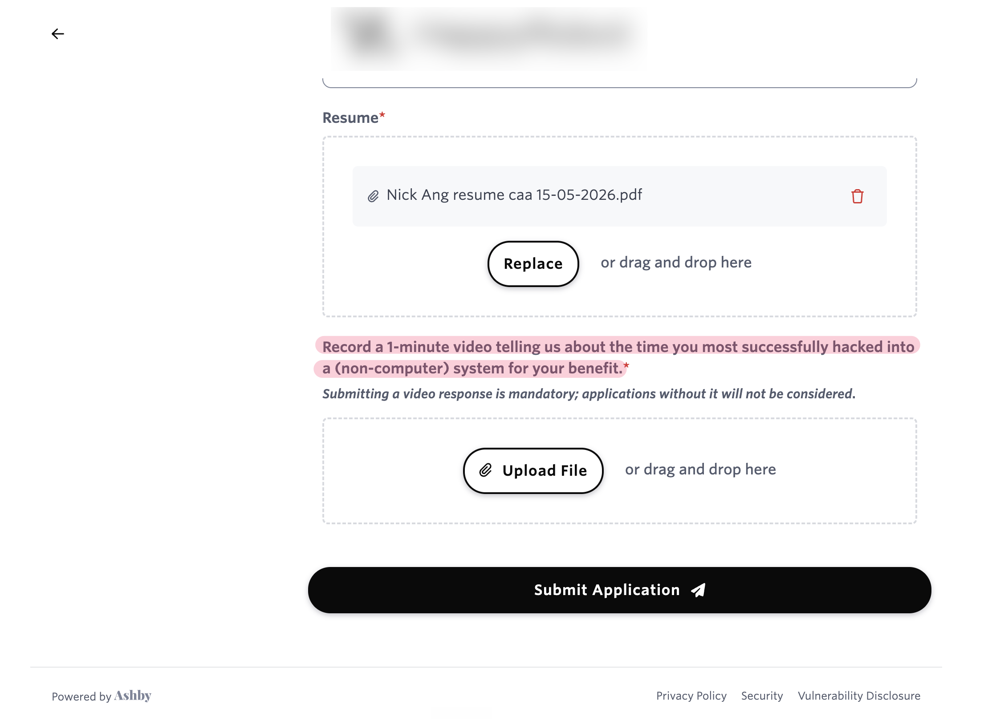

In a recent job application form for a Forward Deployed Engineer, I saw a required field that says:

> Record a 1-minute video telling us about the time you most successfully hacked into a (non-computer) system for your benefit.

I did what I think most people would do nowadays, which is I launched a Perplexity search into the background of this company, to figure if they're a gimmick or if they're substantial (the latter, seems like).

In the end I understood the assignment: in 1 minute, tell me how resourceful, street-smart, and high-EQ you are with a story from your life.

Now, if there's one thing you need to know about me, it's that I'm not someone with an amazing memory. Searching my brain for 5 minutes, I could only come up with one story and it wasn't that compelling.

What helped me tremendously was the combination of two things that summed more than its parts:

1. I have been blogging throughout my 10-year career so far,
2. LLMs enable me to do meaning-based semantic search through my archive with a natural language search query.

This is what I prompted (gpt-5.5):

> Take a look at this screenshot. It's a job application and they're asking for a one-minute video with a very specific demand. I want you to look through this repo, which is my blog, and find any potential stories I could be telling in this one-minute video.

The AI agent went off and did its best to retrieve relevant stories, drawing from my blog's 560 posts, and presented me with 5 stories, pointing me back to the exact source blog post.

Thanks to pi.dev, you can see the exact prompt, tool calls, and output from the LLM here: https://pi.dev/session/#8e7459620210330770a12f9a7faea298

Being able to do this feels like reaching into a new dimension in reality. A lot of these stories would have been lost had I not blogged about them. But even if I did, most of them wouldn't have properly surfaced for use in this application process if not for affordable LLMs.

In the end, I went with #1 and recorded myself in a 49-seconds video explaining how I created explainer videos with my face on them every time I shipped features or bug fixes and how that helped me get promoted to senior engineer and have my pick at leading bigger projects. That was based on a [blog post](/the-career-ladder-is-a-game) from 2024.

The other recommendations were useful too, even if I did not use them for this application:

- The time I figured out [where to collect a residence permit in Berlin for a child born in Germany](/where-to-collect-residence-permit-in-berlin-for-child-born-in-germany), a very specific bit of bureaucracy that required piecing together unclear signals.
- What I learned from [selling used stuff on Carousell](/2018-01-27-ive-learned-selling-used-stuff-carousell), which was really about marketing, positioning, and getting people to care (this was my second choice story).
- The longer-than-necessary route I took to [give away things for free in Berlin](/2021-08-08-why-i-took-the-longer-route-to-give-away-things-for-free), because I wanted the things to end up with someone who would value them.
- My reflection on [using remote work's meeting dynamics as a superpower](/your-remote-meeting-superpower), which was about noticing a new social affordance and actually using it.
