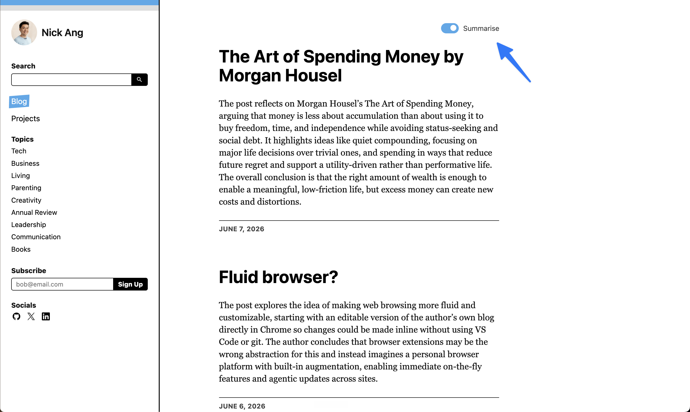

Now you can use the Summarise toggle to browse this blog with AI summaries!

The feature is brought to you by gpt-5.5 (medium) via a voice prompt from my ChatGPT Codex mobile app, with summaries powered by gpt-5.4-mini.

Why build this though? The main reason is that it's makes it easier for anyone to browse through the blog.

I found it unpleasant to scroll through the blog list page because each post varies quite a lot in length, so I'd have to hunt for the beginning of the next post. The AI summary is only a few lines long, making it easier to scan while scrolling.

The other reason is that summaries help me know if I want to invest time reading an article or not. I sometimes re-read my [own blog](/2021-03-07-the-only-reason-you-need-to-keep-a-blog/), so this is for me as much as it is for new readers here!
