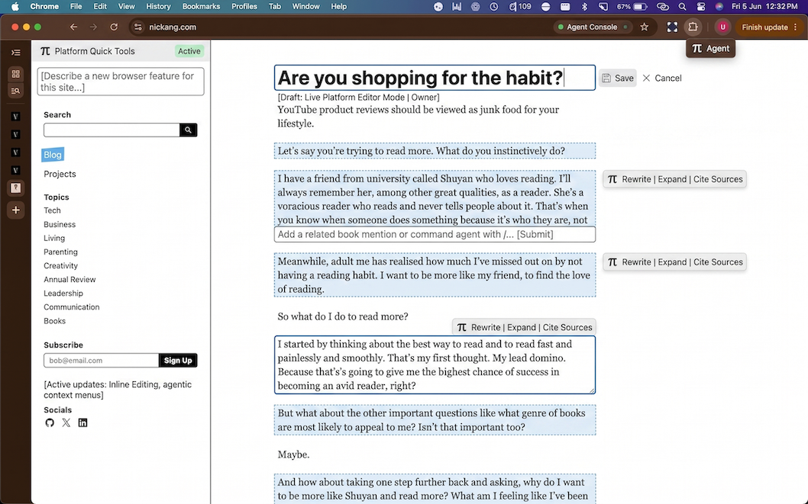

Since [new software can be written really quickly now](/2026-is-the-year-you-cant-afford-to-ignore-ai/), why should our primary way of interacting with webpages not be completely customised?

I had an idea to make a Chrome extension that will allow me to browse this blog and make it editable directly. This would help me a lot because I can skip the dance of launching VS Code, finding the right file, and git pull/push. Instead, everything is an inline field on the page (just for me as the blog owner), which technically should be quite easy to achieve.

But then that thought led to another - why do a Chrome extension at all? This becomes cumbersome when I'd like new functionality for other sites, because I'd need to think about how to slice up the different functionality. Same extension or a new one for every featureset?

Would it make sense to have a single huge extension that augments my entire web browsing experience on Chrome, or would it be better to have them separate?

Peeling off the layers, I come to what I think could be a new form factor - a personal web browser platform, where the extension layer isn't an extension layer, it's literally baked into the browser renderer.

That would enable things like on-the-fly agentic updates, like pi is for agent harnesses but for browsers. Then I can indulge every whim like the one above and have it functioning right away.
