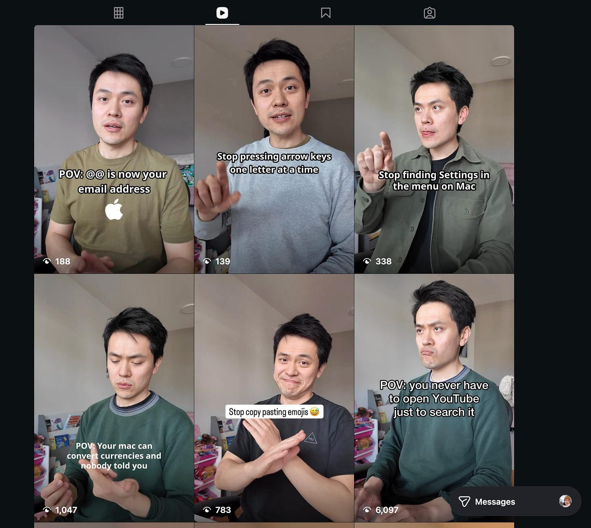

When you work for yourself, when you get to dictate what you focus on, where to pour your heart, who to ignore and who to engage... life changes completely.

Like any employee, I used to dread Mondays.

Mondays represented the start of a week-long slog. It meant being answerable to your boss and your boss's boss, doing what they deem fit. My time clearly wasn't mine. I would have to be subservient to the whims of the company I was working for.

Quitting and going solo totally transformed my relationship with weekdays. It's almost perverse.

Now when Sunday night comes around, I'm actually happy, not sad. When I put Charlotte to bed, I'd start *literally* fantasising about what I'd do on Monday. Recently that fantasy went to many corners:

- I'll record 3 reels to grow my IG following
- I'll squeeze in a substack post to share updates with my more devoted audience
- I'm going test a hypothesis: try starting each reel with a talking head hook rather than gesturing. I think my mouth moving will signal to the viewer to turn the sound on, which should improve engagement
- I'll look through Friday's 3 reels to analyse performance and extract new hypotheses. Then make adjustments for Tuesday's 3 reels
- I'd ideally like to also add in-app notifications to Album (my app) so I can see when friends put a new post up. An alpha tester asked for this and I want it too
- For lunch I want to try that new Chinese place that my wife Charlane cycled past yesterday

The IG account I'm trying to grow with useful tutorials. This is a source of great joy these past few days as I'm learning more about how to ride the algorithm for growth.

I wrote a really detailed list there not to show you the exact thought process, but to show the **powerful drive that underlies everything**. There's curiosity, passion, interest, and energy. After quitting my job and going solo, that drive has grown and waned, but it's trending generally upwards. I'd even describe it sometimes as exhilarating.

The other day, our friends were over for dinner. One of them says, "so, Charlotte has kindergarten tomorrow, right?" I think for a while and say, "no, tomorrow is Sunday, right?"

My friends give me a puzzled look. I return the same look, because I genuinely thought it was Saturday. Turns out, it's already Sunday. I realise this and I blurt out, "Omg! Tomorrow's Monday? YAY!!!" Of course, I had to explain myself to my friends, who are still employees.

When I first realised that I'd become such a person, I was incredibly happy and in disbelief. I never knew that I could feel so much empowerment and so much joy from working. But it's true. It's here. This is now my reality, 5 days a week.

I've become the person who can't wait for Monday. And I'm never going back.
