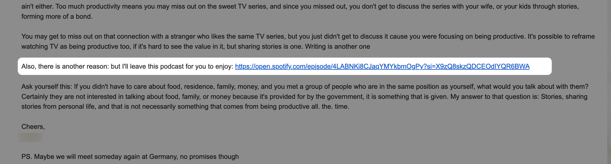

I send out a substack and a few days later, an email lands in my inbox that changed my life.

In this email, this person whom I know from a brief stint in Singapore and felt a connection with, shares a link to a [podcast episode](https://open.spotify.com/episode/4LABNKi8CJaqYMYkbmOgPy?si=X9zQ8skzQDCEOdIYQR6BWA). It's Lenny's podcast where he interviewed a man I'd so far never heard of: Matthew Dicks.

Matthew is apparently a really prolific, really successful storyteller. He literally tells stories about his life on stage that moves people to tears. He has won awards and has also told a story on TED.

I learned that from looking him up after listening to that podcast episode.

I then ordered his book, Storyworthy, and when it arrived, I finished reading it in a few sittings.
