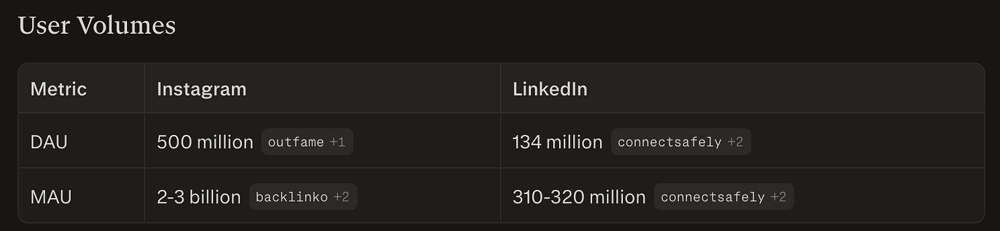
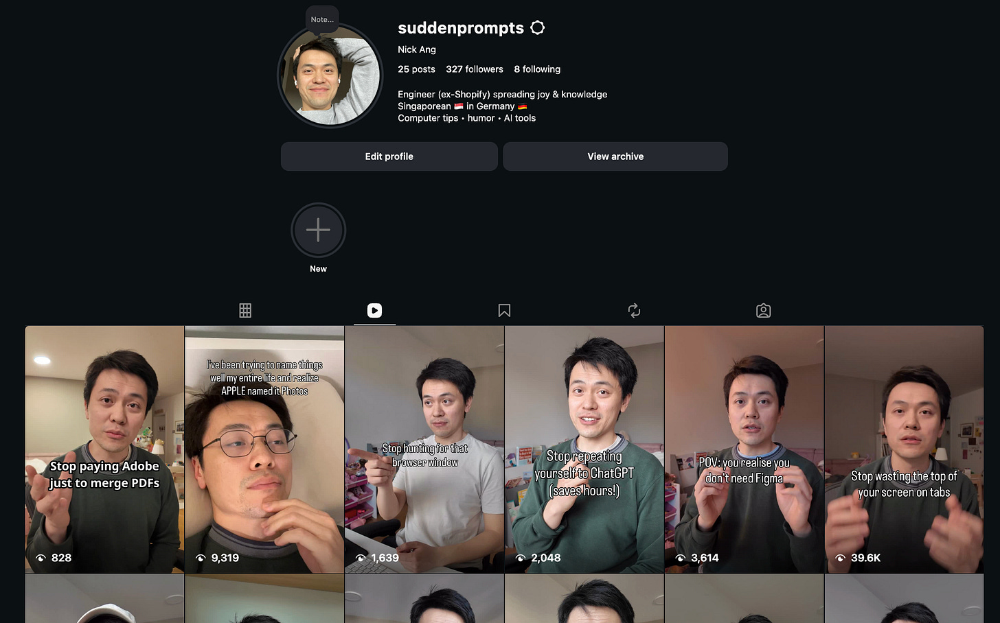

Alright I’ve got about an hour to write this newsletter so let’s dive right into it!

In this post I’ll share everything that has happened and what I’ve learned from growing a new Instagram account from 0 followers to 327 followers at the time of writing in one week.

The results surprised me – the uneven distribution of interest media, the 2 viral videos (160k views each), the effects on my brain – so it’s going to be a fun one.

No more ado, let’s go!

1. In an [earlier post](https://nickang.substack.com/p/when-success-comes-fast-you-know) I said I was aiming for 500 followers by 8 April (2 days away). That goal is within reach if one of my reels goes viral again.
2. For context, I gave myself 1 month to get too 500 followers by using my wife Charlane’s playbook. She’s grown her account now from 0 to almost 7000 followers in less than 2 months.
3. Did I give up? Yep. Shortly after starting the account and posting my first 5 reels, I felt what I’d describe as “disgust” towards what I was doing. I realised from that that I can’t simply copy someone’s playbook exactly. I almost gave up entirely and never came back.
4. So from 10 March to 27 March, I basically posted nothing because I’d given up. Yet I’m close to my 500 followers target! This surprises me.
5. I gave Instagram another shot because of two reasons: (1) Charlane’s explosive Instagram growth ([@septemberhugs](https://instagram.com/septemberhugs)) showed me that it can be rewarding for everyone involved. Some of her followers started commenting and DM-ing her, and real lives were connected in intimate ways; (2) I remembered about Zander Whitehurst’s Instagram account (717k followers) and believed I could do something similar.
6. I’ll get into Zander Whitehurst in a bit, but here’s the reason he’s important in my return to IG – **the playbook of Charlane has one core tenet, and that’s to copy and paste**.
7. Copy and paste? How unoriginal! Yes, you can be original all you want and take 6 months to grow to 500 followers, or you can copy what’s working and take 1 week to grow to 327 followers, 2 videos above 100k views, 2 videos above 10k views, and almost all videos above 1k views.
8. What copy and paste means: find someone whose style you can see yourself emulating and copy either exactly the style and format they use, or style, format, and content. For me, that’s Zander Whitehurst ([Instagram](https://www.instagram.com/zanderwhitehurst/)), who posts design content (think Figma). I copied his style and format and I brought my own content.
9. What copy and paste could also mean: find not someone but 100 different someones whose individual reels inspire you, made you laugh, made you stop and feel somethihng. Bookmark those and copy that exact format, from the visual hook to the below-reel caption to the rough duration to even the music choice. It’s your face on their content.
10. Once I started copy and pasting, I realised just how many IG reels are repeated. And there’s no cap to the engagement on each practically-duplicated video because somehow people forget or there are simply more people who haven’t seen that particular concept yet. Charlane repeated one reel exactly and exceeded the view count of the one that she copied from – and it was a one-for-one copy and paste!
11. Speaking of one-for-one copy pasting, here’s the truth: you can try your darnest to make an exact copy of the original video you’re copying and you’ll always end up with something that’s unique. Lighting, comedic timing, body language, facial expressions, micro body movements, the exact shade of your skin, eyes, hair, geographic location, and idiosyncracies all come through in subtle ways. [Everything is a remix](https://www.everythingisaremix.info/), not a carbon copy.
12. I now know that I will never know which video is an original and which is a copy. Highest view count doesn’t prove originality. And it’s impossible to trace the true origin of a reel because… there’s no such feature to search the entire IG database for who posted a particular reel idea first.
13. Does it matter who did it first? This is not academia. I realised that what IG really is is a **meme distirbution machine**. And I don’t mean it in a bad way. Memes are surprisingly effective in getting culturally relevant ideas to spread across the internet (and thereby society). They can be weaponised for sure, but they are also being used to spread joy, laughter, and knowledge.
14. Memes are also incredibly compact. A positive side effect of building an attention-harvesting monstrosity that is IG is that it forces you to compress what you’re trying to say in less than 20 seconds. For better or worse, engaging in IG in this way has taught me more lessons about **ideas packaging** than any other endeavour. I have to first make interesting content, before the useful part of the content will be given an audience. That applies across scales, from within a single 20-seconds reel to across the body of work on an account.
15. I’ve heard people like Nicolas Cole (a very online writer-teacher) that if you want to earn money through your writing, you should not start a blog. When I first read that advice I understood it only intellectually. Now, after 1 week of producing 2-3 reels per day, I understand it emotionally. “Don’t start a blog” means don’t publish your writing in a place where there is no built-in distribution. Instagram and TikTok are the two main platforms with the biggest built-in distribution. That means it’s *possible* to actually go viral there.
16. Virality is how you go from nobody hearing/watching/reading what you say, to at least some people doing so, **within a timeframe that is feasible for bootstrapped solopreneurs**.
17. It’s literally viral. I’ve had two IG reels go viral back-to-back. How it works is literally biological: I upload something really cheeky → IG shows it to 100 people → 30/100 resonated with it so much that they showed it to 1-100 more people each (1 = DM, 100 = repost on their Stories) → their friends in turn showed it to 1-100 more people, and so on. Imagine a tree with branches. Each branch has more branches and more leaves.
18. It’s worth double-clicking on virality here and trying to apply it to various platforms.
19. Instagram and TikTok = massively viral networks (10/10). They’re meme distribution machines. Once your viral reel lands on someone’s feed, they may even remix (or “copy”) with their own version of that reel, thereby spreading the virus wider.
20. Substack = not viral (5/10). I can write here on Substack and have nobody see me until one of the bigger publications in my niche uses the Recommend feature to say something nice about my little newsletter. When that happens, there should be a transfer of subscribers in one direction. If I return the favour, there will be a crossover of subscribers. That’s not virality though, that’s diffusion. If you’ve hung around on Substack Notes you’ll know it’s not quite what it was promised (it’s mostly inactive).
21. Medium = was viral, not anymore.
22. LinkedIn = somewhat viral (7/10). I’ve gotten one or two posts on LinkedIn where there was unexpected engagement and views. I think that happened when someone who’s considered a thought leader in a particular space (in the eyes of LinkedIn’s algorithm) reacts and comments on a post. That endorsement signals to LinkedIn to share that post also onto the feeds of those who follow that thought leader. Where it loses 3 points is the size of the network. From a lazy search on Perplexity, Instagram has 500m DAU and 2-3b MAU compared to LinkedIn’s 134m DAU and 300m MAU. That 10x MAU is like warm bodies for a virus to spread.
23. I can’t believe how much I’ve learned about virology from doing IG.

## My Instagram account and stats

- [@suddenprompts](https://www.instagram.com/suddenprompts) - sharing this in case you’re curious to sample the sauce

- 30 Mar: 8 followers, 6 posts
- 31 Mar: 17 followers, 12 posts
- 1 Apr: 29 followers, 15 posts
- 2 Apr: 150 followers, 17 posts
- 3 Apr: 220 followers, 19 posts
- 4 Apr: 254 followers, 21 posts
- 5 Apr: 307 followers, 23 posts
- 6 Apr (today): 327 followers, 25 posts

I hope that by reading this post, you take away the idea that “viral” is not a dirty word, copying is really remixing, and that the current form of social media *can* have some positive impact in this world if you use it well.

I intend to continue spending time producing reels on my account. Updated goal, now for end of April: 5000 followers. It’s an extremely ambitious goal, but since I’m outperforming Charlane’s own growth when comparing the initial spurts, I think I have a tiny chance at that.

Ultimately, as a solopreneur, follower count means distribution, and distribution is one of the keys to unlocking sales.

The nice thing is that by making reels, I’m forced to learn about my interests and how to package them in ways that has the highest chance of being well received. I’m effectively already doing sales.
