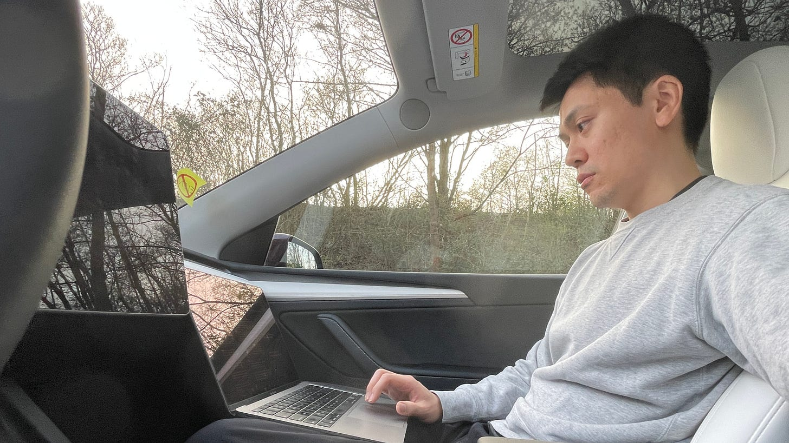

Working from the car in between shuttling the kid to classes after kindergarten

I have a confession: I hate Fridays now.

Just this past Friday, I turned to Charlane and said, "I have a problem."

"What is it?" she asks.

"I hate it when it's Friday because it means the weekend is here. I don't like that I'm like this now. We used to look forward to weekends when I was employed. Now it's totally flipped and it feels awful!"

I pause, then admit: "I think I would be able to enjoy the weekends properly again when at least some money starts trickling in. Until then, I just feel stressed not working on weekends."

I look at her. "Do you feel the same?"

(For context: Charlane is a freelance makeup artist pivoting away from services into media as a content creator. She's in the same boat as me – zero income, building from scratch.)

"Nope," she says.

"No? How do you do it? What's your trick???!"

"I just don't think about it."

I pause to process this. Hmm...

"Oh. That sounds like it could work. So your solution is denial?"

"No, not really," she says. "I just think about the money when I need to think about the money. We have savings to rely on and we're not at that point where we have no more money to pay our bills the next month, or the one after that."

She reminds me of something I'd completely forgotten: I'm still receiving unemployment money from the German government. I'd categorized it as "not income" in my mind because it felt like a handout, not something I'd earned. But income is income – it's cash you can spend. That lasts until May 2026.

"I will think about it when I need to think about it," she continues.

"Until then I'll work towards the goal, but without sacrificing time with family on weekends thinking about work. We have both done that for a while and it's not sustainable."

---

>

**"Don't take damage when you're moving through the streams at a steady clip"** – *Nate Soares, [Replacing Guilt](https://replacingguilt.com/)*

---

I think Charlane is right.

As an ambitious person trying to build something, I have this voice that whispers that I should be working all the time. Every moment I'm not coding, writing, pitching, or shipping feels like wasted time.

That's how I came to dread weekends.

But this way of operating is based on guilt, and guilt is a terrible fuel source.

Nate Soares writes about this in his book Replacing Guilt. He argues that **rest isn't a reward you earn after completing all your tasks. It's not the finish line. Rest is part of the goal itself** – it is one stream among many in a life of continuous activity.

Sustainable motion requires accepting that life involves continuous streams of activity, with rest as a natural component, not a guilty pleasure.

When you're building with no income yet, of course you won't be profitable. You just started! But that doesn't mean you should sacrifice weekends with family to feel like you're "hustling hard enough." That's guilt talking, not effectiveness.

Think about it: if you value family time but squander large moments on weekends stressing about revenue that isn't there yet, your performance will actually decrease when the new week comes around. You'll burn out before you see results.

The practical reality check Charlane gave me was simple: look at the actual numbers. We're not at the "can't pay bills next month" stage. I have unemployment income flowing in (even if I'd forgotten about it). Charlane has some freelance work. We have savings.

Don't discount your cash inflows, even if they're not from your business yet. Government support, investment dividends, a partner's income, freelance gigs on the side – these all count. You might have more runway than you think.

You decided to take the plunge into entrepreneurship. That means accepting a period of no income. But it doesn't mean non-stop work to prove you're "serious enough."

Rest in motion. Work sustainably. Think about the money when you need to think about the money.

The business will come. In the meantime, your family still needs you present – not physically there but mentally somewhere else, stressed about revenue that doesn't exist yet.
