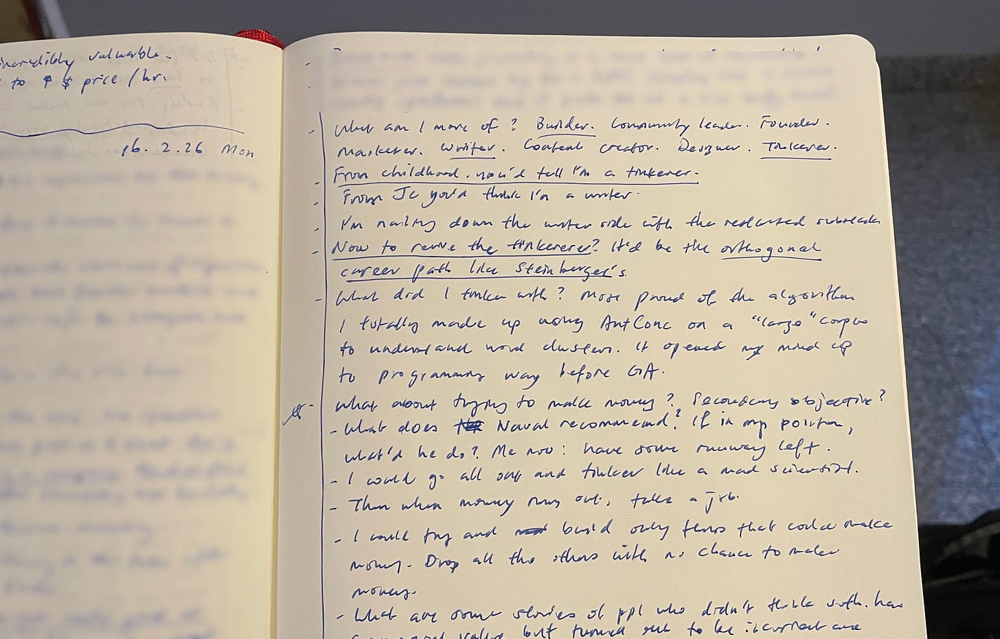
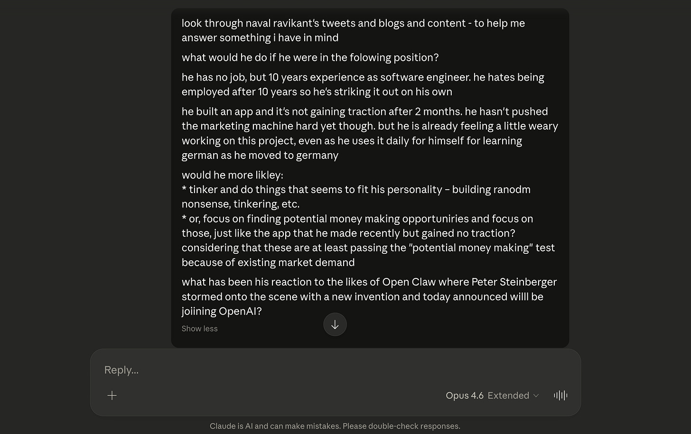

I'm at a crossroad and I have to decide. It's been 7 months since I left my job and I keep coming back to that fact. *It's been 7 months, Nick.*

The inner naysayer's voice is starting to get louder, but I feel I have at least a few more months of beating back that nasty gremlin so I can keep this solo dev experiment running.

The nice thing is that in some ways I'm already making inroads. For example, I have – in my opinion – successfully rebooted this newsletter from a sleeping cat to at least a pouncing cat. We've gained 12 net new subscribers since I started posting regularly again a week ago. (Hello and welcome!)

---

My iOS app, [Youtionary](https://youtionary.com), however, is another story. Since launch, it's gotten 1 paid subscriber and only a handful of monthly active users. Fewer than 10 users out of 100+ who have installed the app come back to the app and use it regularly. I'm one of that 10.

Don't get me wrong, I love my app. It works! It's also been fun to build the first version of it, put it out there with an [announcement post](https://www.linkedin.com/posts/nickangtc_my-first-ios-app-is-now-live-i-quit-activity-7420333781959610368-Qbn1?utm_source=share&utm_medium=member_desktop&rcm=ACoAAAaThzYB3wcqQkuZWxukXrICuWqfoqXfmTk) on LinkedIn, and watch people start using it for the first time. Wrote about that here:

But I'll let you in on a dirty little secret: **I'm not having that much fun anymore improving Youtionary**, despite all the appearances I try to put up on social media to make it seem like I am.

I've grown weary of finding out what language learners want from their 'perfect language learning app.' It's kind of obvious that I'm not really that interested to build for this group of people, to be honest, when I actually stop to look at the signs.

For one, I'd been attending an in-person class full of language learners for the last 4 months, and not once did I ever feel compelled to learn more about their particular pain points. I just kept building the app for me.

Then there's the fact that it just annoyed me when I realised that one person wanted a dictionary with synonyms and word family members, while another person wanted scenario-based conversational speech practice with predetermined endpoints but fluid middles (I actually went on to build this!).

The truth about language learners is that they're a finicky bunch, and in this particular case, their finickiness is something I find irritating, not exciting.

---

So, as I was saying, I'm at a crossroad: **find another potential money making app to build, or just go off and tinker whatever tickles my fancy?**

This morning's journal entry in the hotel lobby

I journaled about this question this morning and ended up channelling Naval Ravikant, as I often do when I'm at a fork. I asked myself: what would Naval do if he were a software engineer with 10 years of experience, freshly independent, with a product that isn't gaining traction – plus he's already feeling weary?

His answer, or at least the version of it that came through my journal and a very long Claude session: tinker. Follow the obsession, not the market.

Channeling Naval through Claude Opus 4.6 with 'extended thinking', exactly what I needed

Here's what I think I'm going to do: I'll tinker.

Practically, I can do this because I still have a few months of runway (I'm receiving unemployment benefits until May this year).

Logically, I'm afraid if I did market research and only worked on money-making opportunities, I would find myself back where I started with Youtionary – not caring much about other people's angles to the problem, thereby dooming the enterprise anyway.

And it's funny, because if I re-read that last sentence, I'm effectively already drifting down the path of building stuff that I'm personally interested in. If I look at Youtionary as a personal project to help me make long-term language learning fun and effective, I'd say it's actually been a huge success. It's only when I look at it from the angle of a business that I think it's a failure.

I dread going on TikTok to shake my ass for people to download an app that I don't care about sharing with the world. I'd rather spend that time tinkering as a way of figuring out what I should be working on.

---

I'll leave you guys with this from Naval's ghost:

>... if you get obsessive about something, first you'll outwork everybody else because you'll be reading about it for fun when everybody else is doing it for work, second you'll stick with it long enough for it to materialize when everybody else gives up, and third when people show up you'll be the expert.

That sure sounds like he's describing [Peter Steinberger](https://steipete.me/) – the iOS developer who got obsessed with building a lobster-themed AI app (OpenClaw), had it blow up on the internet, and just announced he's joining OpenAI. A tinkerer-builder-writer who followed curiosity into one of the most interesting career moves I've seen this year.

Naval's thinking has been a great crutch as I navigate my journey as an ex-SWE turned noob entrepreneur. As such, I'm recommending two of his resources: [How to Get Rich (without getting lucky)](https://nav.al/rich) and his more recent [episode](https://www.youtube.com/watch?v=KyfUysrNaco) on Chris Williamson's podcast.

Starting immediately, I'm going to reallocate time to tinkering with AI. I'll tell you guys what has come up next week.

---

***P.S**. Are you enjoying where we're headed with this newsletter? If so, what's stopping you from sharing it with your friends? Really, curious to know. Tell me in a reply:)*
