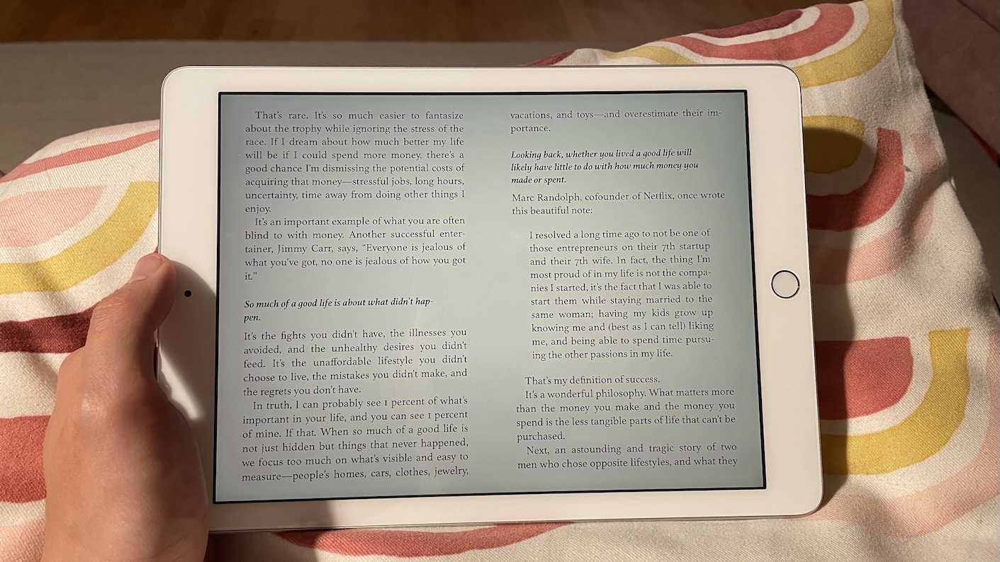

There's an unresolved debate in my head that comes up every now and then: should I read physical books, ebooks, or listen to audiobooks?

One way I tried to resolve this was find out what those people whom I knew were prolific readers preferred, but A) there was no consensus, B) I still couldn't decide.

Warren Buffett prefers reading on paper. He doesn't seem to like reading digital much. Marc Andreessen listens to audiobooks for 2-3 hours a day. Ben Horowitz prefers physical paper books for deep reading. Elon Musk reads literally on his iPhone because he's just seriously too busy to think about format, I guess.

From this futile exercise I took away this lesson: you do you, I'll do me. It's all circumstantial.

I enjoy reading physical books because it is impossible to do anything else with it (unlike an iPad or Kindle). I also like highlighting and annotating and pen on margins is the most flexible and durable medium for that.

But I also love opening the Libby app on my iPad and finding magazines and available books to borrow using my digital Singapore National Library Board card, because it's completely free, instantly available (when there's no loan queue), and in full colour unlike my Kindle Scribe. The downside is its backlight, which tires my eyes out faster.

Then there's my dedicated ebook readers - a Kindle Scribe and a very old Kindle, the original one. I like these too because they are not backlit, can be used to read practically any book you want as long as you buy it from Amazon, and is also somewhat distraction-free (the Kindle store is a source of distraction for me).

Just writing the last few paragraphs has made me realise that there's no right answer. And more revealingly, it shows how stupid this question is.

To bother oneself with an ultimate answer to "what should I use to read books?" is the ultimate form of procrastination and idleness.

You can just read things.

For me, the fastest, most reliable way to [read books](/2019-11-24-always-make-time-for-books/) now is the Libby app on my 10 year old iPad. Practically all books at my fingertips, for free, available to read as soon as I decide I want to read it.

This aligns perfectly with the idea of spending time doing instead of spending time thinking.

As for the longevity of your annotations, the kind of thing that yet some other people like Ryan Holiday (who reads a lot, even runs his own bookstore) swears by, all I can say is, write a note or a blog post.

For books that I've found really useful, I invest time to write a blog post about the key points and publish them under [Books](/books/). The annotations inside the book can then be safely thrown away, which quite effectively decouples the insights from the book medium.
