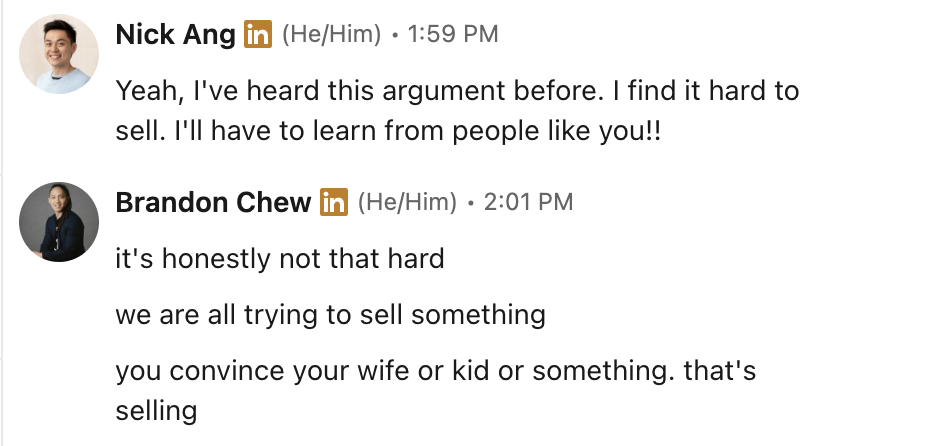

I used to think it was silly that we had to [sell ourselves at interviews](/the-name-card-i-used-to-get-my-first-developer-job/) to land a new job.

When I was in university, I recall being smug about some of my fellow undergrads at another university. My friends and I would sneer at the fact that this other university was enrolling people who were "all talk, no substance."

Invariably after taking these stabs at the unsuspecting undergrads, I'd think quietly to myself:

> It's a sad truth that the world prefers charisma over substance. If you can sell yourself, you'll get far. If you can't, no matter how much you know or how competent you are, you'll never get as far as you should.

I'm about 10 years into a career now and my take on selling has become a little more rounded.

The truth as I see it now is that selling yourself (and by extension, your ideas, suggestions, and opinions) is as natural as biology.

In World War Z, Brad Pitt's character saves the day by noticing that the zombies would completely ignore severely ill people. They'd shamble right past a sick person because even zombies were looking for healthy hosts to infect.

I realise now that human beings are the same way. We're constantly looking for signals and proxies to help us decide what deserves our attention.

I finally understand that selling isn't primarily about persuasion but rather [compression](/practising-idea-packaging/).

There's simply too much information in the world for anyone to evaluate everything on its merits. We rely on shortcuts because we have to. We judge books by covers, restaurants by queues, and job candidates by how they present themselves.

Selling is the act of making the signal easier to see.

In that sense, selling is an act of service. You're taking on the burden of distinguishing signal from noise so that other people don't have to.

A friend of mine who's a seasoned pre-sales Solutions Architect once pointed out that we're selling all the time. Convincing your spouse where to go on holiday. Convincing your kid to brush their teeth. Convincing a colleague to take a different approach to a project.

I thought that was a bit glib, but it points in the right direction.

[Swyx](https://swyx.io/marketing-yourself) put it more bluntly:

> "Like it or not, **people want to put you in a box**. Help them put you in an expensive, high-sentimental-value, glittering, easy to reach box. Preferably at eye level, near Checkout, next to other nice looking boxes."

The rest of his argument was that if you've spent years becoming good at something, you owe it to yourself to spend at least some time helping other people understand what you've become good at.

That mirrors the way I think about selling now.

Putting this into practice, I've started making sure that I look the part I'm applying for. I wore a shirt instead of my usual t-shirt for recent video calls, prepared post-its with stories from past projects, and researched the companies down to a surprising level of detail.

I'm selling myself to get the job.

Then, once I'm in the job, I'll be selling ideas, proposals, priorities, and decisions to colleagues, managers, customers, and direct reports to get things done.

The younger version of me thought selling and substance were opposites. Now I think substance without selling means being invisible.

That feels a lot like Cal Newport's point in [So Good They Can't Ignore You](/2016-03-06-book-cal-newport-so-good-they-cant-ignore-you/): get good enough that your value becomes hard to miss.

If your work matters, and you genuinely believe you can help, then making that easier for other people to see isn't vanity. It's part of the job.
