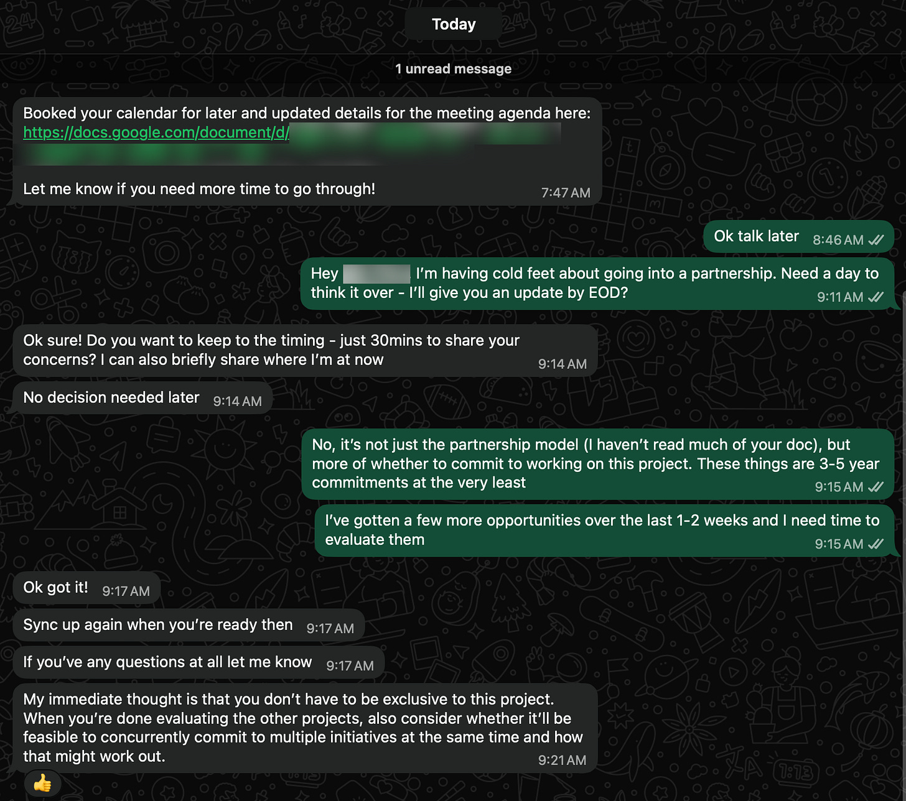
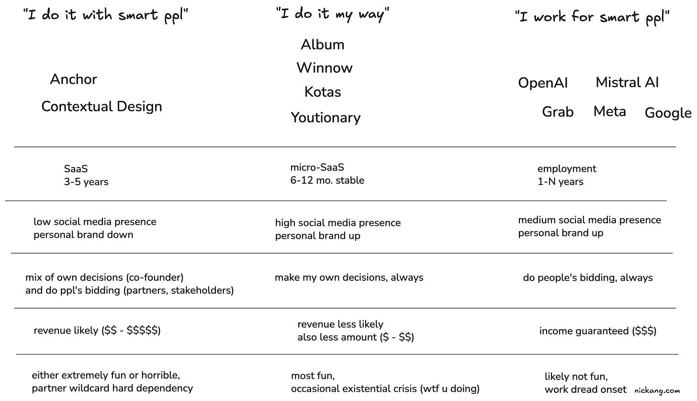
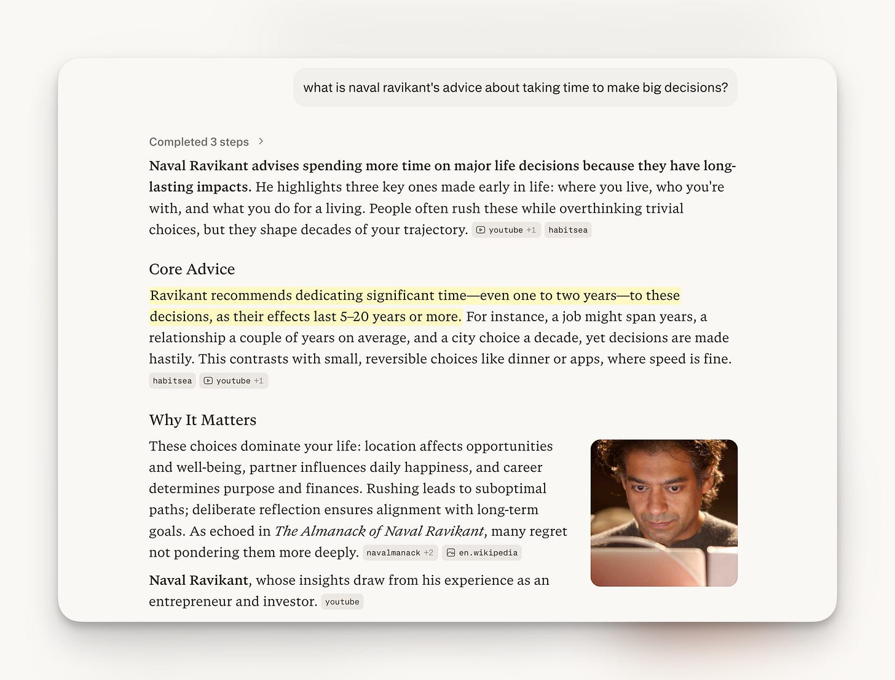

Today I was supposed to have a third call with an old friend to talk about Anchor, a codenamed project that we both think could be a viable B2B business related to AI.

We were going to talk about the partnership model and next steps for incorporation. And instead of showing up, I plunged into confusion and swam in an ocean of uncertainty and messaged this to my old friend and would-be partner:

My message read: “Hey (name), I’m having cold feet about going into a partnership. Need a day to think it over - I’ll give you an update by EOD?”

I’ve been an employee in the startup world for long enough to know that becoming a co-founder with someone is effectively a work marriage for 3-5 years, if not much longer. Since I was already feeling unsure before we began, I had to take a step back to re-evaluate. So I told him straight to buy myself some time to think.

This post is me thinking out loud for you to see.

---

The best distillation machinery I know is a whiteboard and a locked in mind

Once I’d sent that WhatsApp message, I opened up Excalidraw and started putting some structure to my messy thoughts and feelings. The wobbly table above is what I ended up with.

I first wrote down the opportunties that I think are within my reach:

- Bucket 1: working with co-founders to build a business together
- Bucket 2: working on my own things alone
- Bucket 3: working for large companies, mostly AI-related

My old friend and I would work on something called Anchor, which belonged to Bucket 1 (left-most column).

The things I’ve been working on so far since quitting my job are in Bucket 2 (middle column): Youtionary, Album, Winnow, Kotas, and more.

And finally, I could join a company looking to hire senior engineers. That’s Bucket 3.

With these concretised, I started to imagine life under each bucket.

What would it feel like to wake up each day doing that? What level of initiative can I bring to the work? How long is the commitment? Those kinds of questions.

Okay, so I explained how that wobbly table came to be.

Now it’s time to try and make sense of it.

---

Some time this week, a recruiter based in Australia reached out to me. In usual recruiter fashion, he withheld the company name that he’s helping to hire for, but the job scope and the salary were interesting, so I booked the earliest slot in his calendar to talk to him that same day.

But then our call didn’t happen. This happened instead:

The recruiter bailed last minute, on a slot that was in his bookable calendar.

This recruiter reopened some wounds that I’ve suffered when working in the corporate world. Working with people can be either extremely fun and rewarding or extremely annoying and unpleasant.

I was irked by this (you can probably tell if you zoom in on that long screenshot).

Why keep a slot open in your bookable calendar when you cannot actually make it? If this person were a univeristy professor I’d be more understanding, but this person is a recruiter, for christ’s sake. Time and scheduling is literally part of the job and they’re botching it on first encounter.

I don’t know, perhaps this tells more about me than about the recruiter. I can be unforgiving with people when they fail to live up to basic expectations.

Perhaps this is why I’m so hesitant to go back to working for people or partnering up with people. I don’t want to have to deal with people crap.

At this point, I realise that the only viable options for me are:

- find a unicorn team that wants me/my skillset, or
- continue my solo path, making and paying for my own decisions, always

---

In case it isn’t clear yet, the 1 big thing that’s bugging me is this: **after 8 months of no financial results, should I continue solo, or partner up / join a company, especially when opportunities are literally knocking at my door?**

---

The question remains unresolved. I’ll continue to work it out in my head and in my journal.

For now, I’m taking heed of Naval Ravikant’s advice:

Source: Perplexity

Basically: major life decisions – like partnering up with someone for the next 3-5 or more years – should be given more time. I’m giving myself more time.
