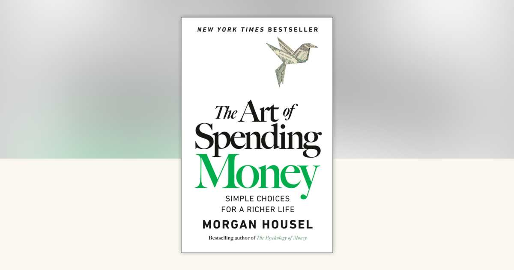

- MH = Morgan Housel (author), NA = Nick Ang (me)

- Billy Markus: "**People are not rational. They are rationalising.** Once you understand this simple fact, all the oddest human behaviour will make way more sense." NA: a good example from my own life is taking a job that pays $200k instead of the one that pays $170k, even if I like the work of the $170k one more. I'd tell myself it's a rational thing to maximise my earning potential, but in reality, I'm just rationalising my deeper truth, which is wanting status or validation.

- How much one brags is the inverse of how satisfied they are with their life.

- "Nature is not in a hurry, yet everything is accomplished." - Lao Tzu. So don't rush to become rich. **Quiet compounding** is therefore a sensible approach to money. It'll help you avoid **social debt**.

- **Social debt** is the invisible debt that accrues when you become rich. It manifests as your fifth cousin expecting you to buy them a house, or friends who like your money and pretend to like you, and you behaving differently because of your money. It's as Henry David Thoreau says, the cost of a possession is more than the money you paid for it - it's the life which is required to be exchanged for it, immediately or in the long run.

- **Quiet compounding** is to stop performing for others. It'll extend your attention to be more future oriented, and you'll gain financial endurance.

- **Parkinson's Law of Triviality** is a fanciful way of what I knew to be "bike shedding" from the software engineering world, which explains the phenomenon where people spend more time discussing features about the bike shed to be installed at a nuclear power plant than about the nuclear power plant itself. The amount of attention a problem gets is inverse of its importance. This is problematic for money because we tend to analyse small decisions (because they feel easier to analyse), like which coffee machine to buy to save $50, than to analyse big decisions like which part of the city to move or buying a house that is $200k more expensive.

- **Writing a reverse obituary** is a good exercise to come up with a shortlist of things you want your obituary to say about you. Once you have that, you spend the rest of your life figuring out how to live up to it. This reminded me so much of Casey Neistat's [admission](https://youtu.be/vFuyiCnROzs?t=789) on DOAC that his whole life has been about trying to live up to the promises he made to himself as a kid growing up poor and conflicted.

- **People see the rewards and don't see (or worse, ignore) the costs.** "Everyone's jealous of what you've got, no one is jealous about how you got it." - Jimmy Carr.

- We attribute too much of people's happiness to what we can see, like cars and beautiful houses. In reality, you know maybe 1% of what's important in my life, and I know maybe 1% of what's important in your life. The quarrels avoided, the unaffordable lifestyle that I didn't choose to live... these are things that never even happened, yet contribute significantly to 99% of my happiness.

- To get off the **hedonic treadmill**, arrange your life such that it easy to have large contrasts. When you expect nothing, everything is a surprise, and pleasant surprises make us very happy. So it's prudent to earn money, save a lot and live like a normal person, and then occasionally splurge on tiny luxuries, instead of chasing new perpetual luxuries. Arnold Schwarzenegger's philosophy applies here: Eat mostly healthy foods. Occasionally let yourself eat delicious food that you know is unhealthy. Otherwise, what's the point? NA: 6 years ago, I came to a similar [conclusion](/2020-09-06-enjoying-a-cuppa-on-the-hedonic-treadmill/) about "what's the point?"

- Chuck Feeney is a great role model of someone who understood the place of money in his life. Cofounder of Duty Free, gave away $8 billion and kept $2 million, living frugally. He explains that he is happy when what he's doing helps people and unhappy when not helping people.

- If a person buys a low-end BMW instead of a **high-end Toyota**, they're likely playing a [**status game with money**](/proud-wrong-things/). But if the other way around, they're likely playing a **utility game with money**.

- MH cites Bezos' **Minimise Future Regret framework** as a useful framework for thinking about how to spend money. The origin of that framework is a story Bezos tells, where he asked himself how much he would regret if he didn't try to build a company when he knew the internet was a big deal, and he said it would haunt him if he never tried, so he started Amazon. The point isn't "go out and take big bets" (that's how this framework manifested for JB), it's "if you're 80, will you regret not having tried spending money for this?"

- **There is no such thing as unspent money.** If I put $500 in my savings account, it's like having purchased $500 of independence, freedom, and time. I used to think of it this way (which I now see is incomplete): [you're buying stuff not with money but with time](/2020-08-30-you-are-not-buying-that-with-money/). **Debt is how many pieces of your future someone else controls.** I love this way of thinking about money because it eliminates the dichotomy of "spend or don't spend" entirely and reframes the question as "what do you value?"

- It's wise to take heed of the **Arndt-Schulz rule** of pharmacology, which states that for every substance, small doses stimulate, moderate doses inhibit, and large doses kill. Money works the same way. There is an ideal amount of wealth to be had. Go beyond and it starts inhibiting you because of **social debt**. Venture too far and it might just kill you (suicides happen even to the mega rich).
