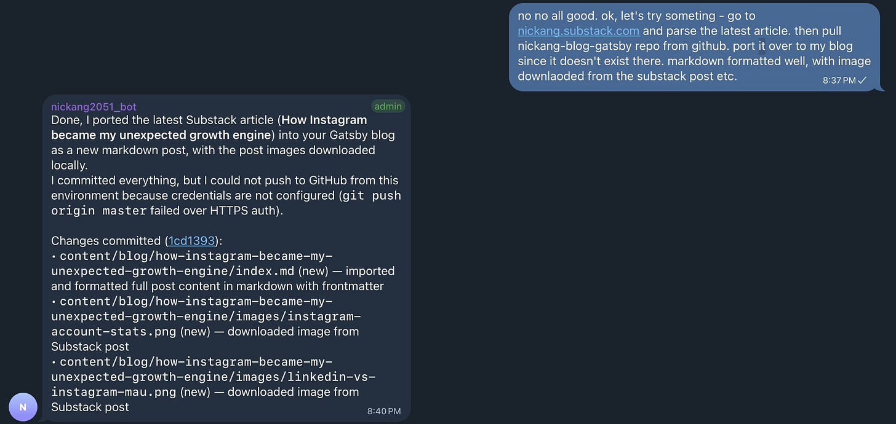
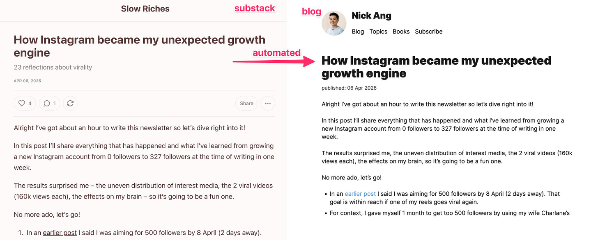
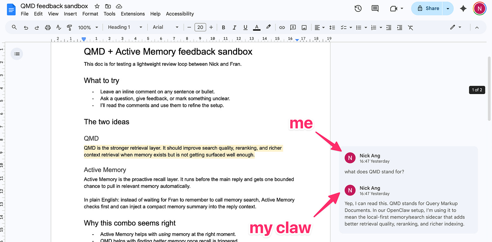

I have to admit something: I may have worked 10 years as a software engineer, but I couldn’t get OpenClaw to work meaningfully even after 4 attempts.

First, if you’re wondering what’s OpenClaw: it’s the fastest growing, most popular codebase on GitHub in existence (more stars than Linux, which is saying a lot). What it aims to do is let anyone have a personal AI agent. For what? Well, that’s the fun part - you can get it to do whatever you want.

But the “fun” part is also the reason why it’s so darn hard to get stated with OpenClaw despite all its promise. It’s wide open for interpretation and setup. Even for experienced developers like me. Or maybe I’m just lazy to read all the documentation for benefits I can’t yet taste…

In this post, I’ll share the one big tip on making it work and one simple reason why I decided to sink more time in trying to get my own Claw going.

## One big tip for making it work

Use [AlphaClaw](https://github.com/chrysb/alphaclaw). That’s the tip.

OpenClaw is very deeply developer-focused. In its current incarnation, it’s practically unusable for anyone unfamiliar with Shell and Terminal and SSH and configs and environment variables and so on. That’s where AlphaClaw comes in.

AlphaClaw is “simply” a wrapper around OpenClaw that makes MUCH smoother to get an instance of OpenClaw up and running and maintaining it over time.

It comes with a lot of sensible defaults (asking you for API keys upfront in a web app interface, clearly signalling some keys are important are others are not really with clever UX design).

Using it is like this: Click next. Type in some key. Click next. Select Telegram. Read instructions on how to pair. Paste key. Click next. Done, paired with Telegram.

For me, using AlphaClaw’s web UI was the biggest unlock so far in getting OpenClaw to work without pulling hairs. The reason it helps is that it gives you a dashboard that tells you everything you need to know and it requires a lot less technical knowledge to understand what’s going on than the built-in OpenClaw dashboard.

## One simple reason I’m sinking more time into it

This is it, in a screenshot:

On Telegram, me asking my Claw to try something… and it worked without a hitch (rare, but when it happens, it’s magic)

For context, I write a lot everywhere and one of my biggest sources of low-key stress is WHERE DO I POST?!

I used to write exclusively on my blog (nickang.com), until I realised the reach is very, very small. An unread writer is not really a writer, at least not to me. A writer writes for people to read. So reach is important.

That’s why I started this newsletter! And started posting more regularly!

But this shift pains me and I’ve since ding-donged a few times from Substack → blog → Substack → blog → Substack (now) and it’s really frustrating. The core tension is:

- Posting on Substack gives reach, but if Substack shuts down, I lose all my content
- Posting on my blog gives full content ownership, but SEO is dead and there’s very little reach

I want to own my content AND have reach. To do that is very hard… until now!

My substack posts now get ported over to my blog automatically with an AI agent that checks Substack once a week

So that “experiment” I asked my Claw to do worked without a hitch based on this prompt:

>

ok, let’s try someting - go to nickang.substack.com and parse the latest article. then pull nickang-blog-gatsby repo from github. port it over to my blog since it doesn’t exist there. markdown formatted well, with image downlaoded from the substack post etc.

This single message I sent to a bot on Telegram managed to get a post from my Substack newsletter into my personal blog. I can’t tell you how much this blew my mind, because previously this would have been a half-a-day task if it were to be robust, and I just never found time to try and do that.

Once that worked, I simply told it to “make it a skill” and “run this every Sunday at 10pm, checking latest 10 posts, porting over whichever doesn’t yet exist on my blog” and now it's automated.

What. A. Time. To. Be. Alive.

Call me a simpleton, but this level of ease of automating things is something I find very valuable.

Another thing I tried:

>

hey, try something for me now - u should have google docs read/write credentials. find out where they are stored, then create a short google doc and send me a link to it. it should live in my account after that since hte creds are from GCP authorised to my account

And that eventually led to my Claw creating a google doc in my google drive, sending me a URL that just works, with a document for me to read and annotate with inline comments… and my Claw can even read my inline comments and reply inline:

The moment I realised I’d unlocked a new world of AI collaboration.

These are just two immediate use cases I thought of. People who are experimenting with making the most out of their OpenClaws are waaaaay ahead of this. Busy people like Garry Tan (CEO, Y Combinator) have been outputting tonnes of useful things for everyone to use, like [gbrain](https://github.com/garrytan/gbrain) and [gstack](https://github.com/garrytan/gstack), and they’re doing it while [sipping piña coladas](https://x.com/garrytan/status/2043100662549090516) sending voice messages to their Claws during their off-time. (Maybe this says something bad about what off-time now means, I recognise that, but hey, if he’s having fun producing useful things, I see no fault).

## Tiny bit more context on how I’m using AlphaClaw

Here’s my timeline using it:

- Tried it yesterday with the 1-click install on Railway (hosting provider)
- Played with it for hours during pockets of downtime looking after sick kid at home
- At end of day, I realised 8GB vCPU, 8GB RAM, 4GB disk space was too little, so I shut it down and re-set up the thing on my Linux laptop, which is now always-on

The easiest way to get started is to use Railway or Render (may need to pay – I have the Hobby plan on Railway). Click, done. Then if you have a spare laptop at home, you can then install AlphaClaw there eventually for free (as in, you pay only electricity).

See the [AlphaClaw repo](https://github.com/chrysb/alphaclaw). Hat tip: Garry Tan’s [gbrain](https://github.com/garrytan/gbrain) was what alerted me to its existence.

## Claw forward

So here’s my advice if you’re still on the fence or sleeping on the wave of change that’s coming with AI: think of ONE potential use case and start trying things like OpenClaw.

With AlphaClaw (the wrapper around OpenClaw), you’ll be spared a lot of frustration.

With a single positive outcome, you’ll see the light and you’ll finally find motivation to get to the other side of the tunnel.

At least that’s what seems to be happening with me. After many false starts, I’m starting to get some value out of my Claw. I hope you’ll find some too.

---

Closing remark: I’m sooo much happier writing this Substack post now because I know it’ll land on my blog next Sunday without me doing anything:)
