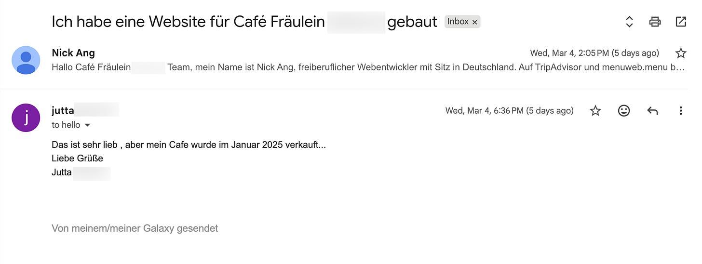
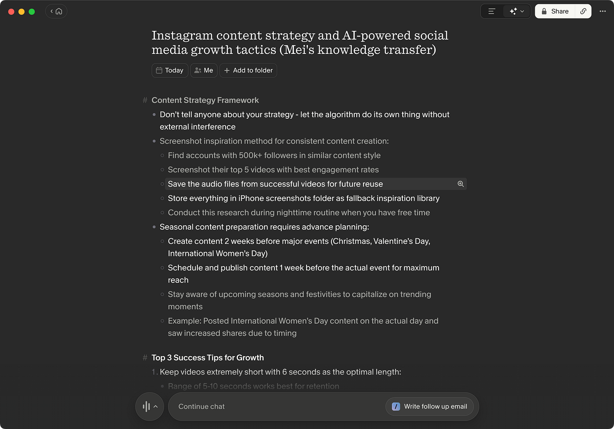

Alright, time for a no bullshit update on how my "business" is doing.

A quick look at my timeline so far:

1. Quit my 100k € SWE job in June 2025 to go solo
2. Started YT channel sharing expat stories
3. Pivoted to building a video editing tool
4. Pivoted to building an AI language learning app. Published to App Store. Got 1 paying subscriber
5. Currently: Pivoted to building websites for restaurants, cafes, salons, tuition centers, etc.

How's all that going?

Well, I sent a total of 45 email pitches with custom websites (already hosted) to German restaurants, cafes, and salons. One replied, and they didn't convert because they had already sold the business.

Translated from German, she replied: "That is lovely, but I sold my cafe in January 2025" 😅

I also sent a total of 20 custom website email pitches to Singapore restaurants, cafes, salons, tuition centers, and fitness studios. Zero replied.

So, total revenue from the latest experiment of building websites? Zero 🤷

Of all experiments so far, my total revenue is: 2 months of a paying subscriber for [Youtionary](https://youtionary.com) = **13 € net**.

It's a sad state of affairs. But honestly it is only sad if I look at what hasn't been accomplished. Here's how I *actually* look at it:

- I took the plunge and am thoroughly enjoying the freedom to pursue my ideas, change my mind about them, and decide what's next any time
- I thickened my skin as a podcast style interviewer and learned how to work the caerma, setup lights, elicit memorable answers from interviewees
- I learned how it's misplaced to think a 5 € /mo. subscription for a video editing tool could displace a 19 € /mo. tool like Descript
- I learned how to build and launch end-to-end an app on the App Store
- I realised how difficult and important marketing is, firsthand, having a functioning app that I use daily not being discovered by anyone else on the planet because of lack of marketing
- I trial-and-errored a fully functional workflow using AI agents to prospect, create custom websites, deploy them, write cold outreach email pitches, send them out with a custom domain, track the status of each prospect, send follow-up email if no response, cleanup and teardown hosted sites when prospect denied or bounced

I'm concluding that this is another experiment that has failed and I'm moving on to the next thing (more on that later).

## Another one bites the dust.

But why? Am I not giving up prematurely?

This is a piercing question, one that I've of course asked myself. When is too early to quit an experiment?

I think the answer depends very much on the individual.

When I was fresh out of my 3 months programming bootcamp where I learned to code, which eventually became a 10-year software engineering career, one success just came after another.

The results came in quick succession. First, I was hired as a paid teaching assistant for the next cohort, a testament that *hey, something is working, I'm not bad at this programming stuff*. Then I got my first junior software engineer job. Then I got hired to teach a programming bootcamp myself on weekends. Then I got hired at an ad-tech startup that eventually helped me fulfil my lifelong dream of moving abroad. Then I tried my luck and got the job at Shopify as a senior software engineer, wrapping my career in tech with a nice little ribbon.

I tell you this story because this is what I – as an indivudal, with my own path that's different from yours – have come to expect with success.

In other words, if something werer to stick, they should stick quickly. **When something works, I'll just know it.**

And these numerous experiments that I've embarked on so far? They're not it.

I know people who will persist at least a couple more weeks. People who are more structured in their experimentation.

I'm not really like that. I work in bursts, check if anything worked, and if nothing has, I move right on, completely unsentimental about what was done. This is probably one of my superpowers. It's a good one to have, I think.

## So… what's the next experiment?

Media. I'm going back to experimenting with social media.

I'm talking LinkedIn, Substack, and Instagram.

For context, Charlane has been seeing the biggest spike in her viewership and follower count on Instagram that she's ever had.

For even more context: she has cycled through 5 different IG accounts over the last 1 year or so, experimenting with different content types, schedules, formats, categories, etc. and she has finally struck gold.

And now I'm going to try and replicate her playbook, but in the AI space rather than the culture/lifestyle space. We even sat down for a "teach me sensei" session where she taught me everything she's learned in the last month – where she grew her most recent IG account from 0 to 310k views, 550 followers with 57 reels (+12 trial reels) in exactly 1 month – to help me get started:

My notes from the teach me sensei sit-down with Charlane (this app is [Granola](https://join.granola.ai/t/uf74c2s37p))

Here's how I'm thinking about this:

- In a gold rush, there are gold miners, shovel sellers, and map makers
- I've been trying to be a gold miner in the last 3 experiments in the AI gold rush
- Maybe despite (or because of!) my engineering background, I'm just not that good at knowing what products to build yet
- Maybe I can hone that skill on the side while I focus on building a distribution chanel (focusing on making maps of where the gold is in the AI era)
- If I have shovels or gold to sell, good, I'll have people to sell to directly
- Map makers can make good business selling maps

Something like that. I don't have it all figured out, as usual. It's impossible and would suck the air out of the room anyway.

But it's probably worth clarifying the positiong: a map maker in a gold rush is the person who collates data, reads the news, sieves through hearsay, and publishes the signals (in the form of a map) to the greater population. Some are already gold miners, others are aspiring gold miners.

I think this has potential, because AI is a once-in-a-lifetime kind of technology that sweeps across humanity like a tidal wave. Everybody's going to get wet. Better know where the high grounds are. *Oh hey! Follow me! You'll get entertained while being informed about the best places to stay dry and overlook the land.*

Practically, this means I'll be trying to post up to 3 reels a day on a new IG account and trying to keep that up for a month and adjusting as I go.

**The goal: 500 followers by 8 April.**

To keep the IG algorithm pristine, I will share the IG handle only at a later time:)

In the meantime, this newsletter will continue to be where I'm posting these meta progress updates and lessons from the trenches, so stay tuned (and share if you find them valuable!)
