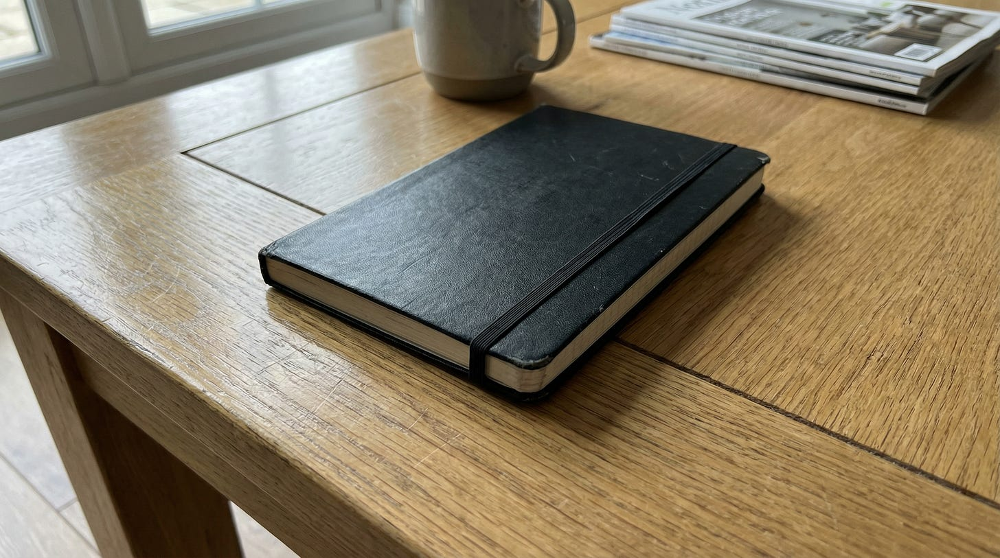
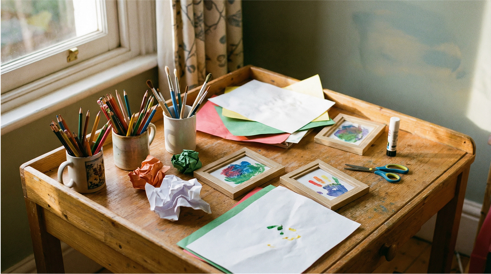

In the morning, my mother-in-law tells Charlane (my wife, her daughter) that she’d just bought an online course from a TikTok creator. A TikTok creator selling a course on how to become a band keyboardist.

The course cost 4000 RMB, around 550 euros.

My mother-in-law has never been good at saving money. All her life, she couldn’t keep money in the bank. She’s been cheated multiple times of huge sums of money. Her husband had always been the one keeping their finances, and when he passed, she practically burned all her money overnight.

So when she tells Charlane that she’d just spent a significant portion of her bank balance on a piano course, as someone who never played the piano, Charlane was – understandably – livid.

Charlane and I are both starting our own businesses right now, burning cash. We are feeling extra defensive about money mistakes.

---

Later that evening, our daughter Charlotte comes home from kindergarten. The first thing she sees when she enters the living room was her mum’s notebook.

It’s a black leather-bound Moleskine and Charlotte immediately likes it. She then proclaims that she needs one just like it.

Need, not want. Our 4 year old is telling us she *needs* a Moleskine notebook.

So I try to explain, “you don’t need this. You want it. But you already have a notebook.”

To which she says, “no, I really NEED it!”

We go back and forth a few rounds, and she gets visibly more and more upset. By now her head is cocked, her face scrounged up in the middle, and she’s whining. About a black notebook that she didn’t know existed a second earlier but now suddenly needs.

I take a deep breath. And then I take a second deep breath, before I finally say to her,

>

“Charlotte, the most miserable people I know are the ones who are never satisfied with what they have.”

She looks at me. *Miserable people? Why is this crazy dad of mine talking about miserable people to me suddenly? Does he think I’m miserable? — *that’s what I think she’s thinking.

I continue, “your grandmother is 70 years old, and she continues to choose to be miserable.”

“We talked to her today about something (referring to the TikTok course).

She is 70 years old. She is surrounded by people she loves and who love her, but she chooses not to pay attention to that. Since she came here, she has been unhappy. She was even unhappy before she came. She is always paying attention to what she doesn’t have, like money.

For your grandmother, Charlotte, money is something she never really had. And she spent more than 20 years trying to get it. The whole time, her attention was on making money.

For 20 years, she did not pay attention to the wonderful things she had. Like having the chance to fly from China to Germany regularly to live with us. To be surrounded by mama and you.

Do you want to be like your grandmother? Because you can choose to be like that. If you choose to be unhappy because of the things you do not have – like this notebook – you’ll continue to be unhappy for the rest of your life. You’ll be miserable.

But look around you, Charlotte. See this? (I’m pointing to her dedicated crafts table and supplies sitting in the middle of our living room.) When we visited Amelia, did you see that she had a special area like this just for her to do handicrafts? When we visited Celia, did you see that she had that?

No. But you do. Pay attention to that. This is what you have. When you were very young, you were already interested in making things with your hands, so we thought it would be a good idea to spend some money to give you this area and to always make sure you have handicraft supplies you can use to create new things.

Not everyone has this. You already have a lot in your life. You’re already fortunate.”

---

Charlotte is looking at the two tables and shelf full of art supplies. Then she turns back to me.

I feel like I’m making inroads, so I say,

>

“You can choose to be happy by paying attention to what you have, or you can choose to be miserable by paying attention to what you don’t have.”

This time, thankfully, she puts the Moleskine down. Then goes straight to her workstation and pulls out a piece of paper and starts sketching something.

As for my mother-in-law, Charlane and I have chosen to adopt the mental model of hauling a burden. It’s like our bodies are heavier than they were, so we’d better strengthen it to be able to pull that weight.

You might think I’m being unkind for writing about this. You’re at least a little right. But I’m not writing this to shame or even to vent.

I’m writing this to encapsulate the **frustration of seeing people waste their lives chasing for more, mistakenly thinking that they’re poor, when they’re actually already rather rich. **

The young don’t know enough. The old don’t pay attention enough. The rest of us are somewhere in between.

That’s where slow riches are built.
